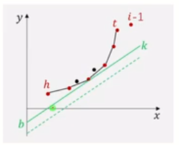
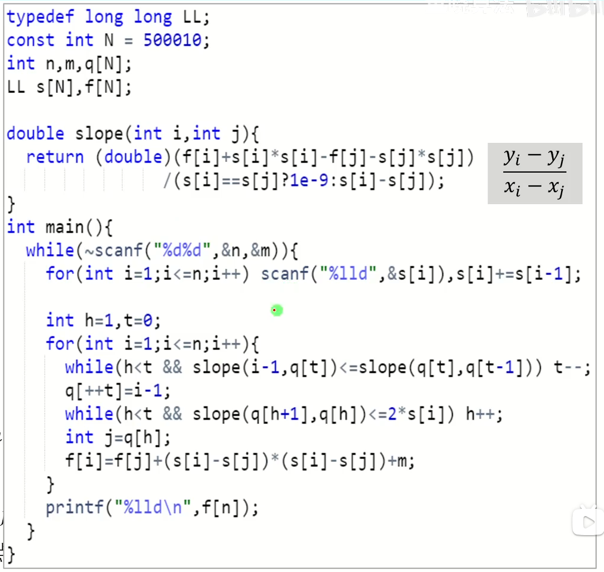

对于朴素 DP，有几种常见的优化方法，本文主要介绍**单调队列**和**斜率**优化。

## 单调队列优化 DP

例题：[P1886 滑动窗口 /【模板】单调队列](https://www.luogu.com.cn/problem/P1886)

单调队列是一种特殊的双端队列，从字面上理解，就是具有某种单调性的队列，例如递增或者递减。一般来说单调队列可以用于维护最值，解决滑动窗口类的问题，时间复杂度是 $O(n)$。

单调队列的维护可以通过不断添加新元素，并不定时访问或者删除旧的元素。

以上述例题为例，我们可以如何求出单调队列的长度呢？

- 最简单的方法：枚举滑动窗口的左端点和窗口长度，再求出区间内的最大、最小值，时间复杂度 $O(n^{2}k)$；
- RMQ（区间最值）类算法：同样枚举区间，通过预处理优化求区间最值的时间复杂度，最终为 $O(n^2 \log_{2} n)$。

我们可以发现，这两个算法都存在一个问题：一个序列 $a_{i},a_{i+1} \cdots a_{j}$ 和同样长度的 $a_{i+1},a_{i+2} \cdots a_{j+1}$，其中有长达 $j-i-1$ 的区间是重复的。

这里，单调队列优化就有用了。我们用一个例子来说明单调队列如何工作：

```
1 4 5 -1 0 3 1
```

假设当前的区间长度 $k=4$，我们只求最小值，那么：

- 队列初始为空，1 入队；
- 由于 1 入队时间早于 4，有可能在 1 出队后，4 成为新的最小值，因此 4 进队；
- 同上原因，5 入队；
- 这时候我们遇到了 -1，它小于队尾的 5，并且 -1 的入队时间晚于 5。那么如果 -1 入队，5 出队早于 -1，并且只要 -1 在队中，最小值都不可能是 5，因此 5 出队；
- 同上原因，4 出队；
- 由于上面主要原因已经讲完了，所以下面就简单地带过：0 时间晚，入队；
- 3 时间晚，入队；
- 1 时间晚，且值小，3 出队，1 入队。

通过上述过程，我们可以发现，无论到哪一位，我们都维护了一个**单调**递减的队列。由于本题还要求区间长度，我们还应当记录队列中元素的位置，如果超出范围就同样出队。

那么问题来了，时间复杂度是什么？看起来，我们枚举左端点，还要将一些不符合条件的元素出队，好像来到了二次方，但是考虑枚举左端点时，所有节点只会进队一次、出队一次，所以本题总时间复杂度可以优化到 $O(n)$。

代码实现：

```
#include <bits/stdc++.h>

using namespace std;
int n, k;
int a[1200000];

int main() {
    cin >> n >> k;
    for (int i = 1; i <= n; i++) {
        cin >> a[i];
    }
    deque<pair<int, int>> q;
    for (int i = 1; i <= n; i++) {
        while (!q.empty()) {
            if (q.back().second > a[i]) {
                q.pop_back();
            } else {
                break;
            }
        }
        while (!q.empty()) {
            if (q.front().first <= i - k) {
                q.pop_front();
            } else {
                break;
            }
        }
        q.push_back({i, a[i]});
        if (i >= k) {
            cout << q.front().second << " ";
        }
    }
    cout << endl;
    q.clear();
    for (int i = 1; i <= n; i++) {
        while (!q.empty()) {
            if (q.back().second < a[i]) {
                q.pop_back();
            } else {
                break;
            }
        }
        while (!q.empty()) {
            if (q.front().first <= i - k) {
                q.pop_front();
            } else {
                break;
            }
        }
        q.push_back({i, a[i]});
        if (i >= k) {
            cout << q.front().second << " ";
        }
    }
    return 0;
}
```

本题的题解大多采用的是数组模拟队列，但是本蛾子认为虽然 STL 的常数是模拟的 1.5 倍，但我们必须知道这是因为其功能的丰富。一个冷知识，deque 可以随机访问；另一个冷知识，几乎所有 STL 容器都可以顺序访问；再一个冷知识，map、set 等加入元素会自动排序。在数据范围明确的情况下，我们还是要遵循 C++ 封装的思想。

那么，这与 DP 有啥关系？很显然，例如在 LIS 中，我们需要在前面所有的 DP 状态中寻找满足某个条件的最大值，那么我们可以用一个单调队列维护最长 LIS，代码实现在之前的集训笔记中已经记录了，大家自取：[集训笔记：动态规划经典模型 1](https://old.bug-barrel.top/archives/55)。

至于其他应用，本蛾子实在来不及写了，大家可以参考这篇洛谷博客，讲得也很好：[单调队列优化dp](https://www.luogu.com.cn/article/1u1affxp)，也可以自行在 OI Wiki 上搜索相关伪代码来理解。

## 斜率优化 DP

相比于很直接、简洁的单调队列优化，斜率优化就复杂了许多。

前面我们看到的单调队列优化，主要适用于状态转移方程类似 $f_{i}=\min_{0 \leq j \leq i-1} f_{j}+a_{i}+b_{j}$ 的 DP，因为这里求最小值的操作是线性的。

但是，当我们遇到形如 $f_{i}=\min_{0 \leq j \leq i-1} f_{j}+a_{i} \times b_{j}$ 的方程，我们就需要进行斜率优化来获得更高效的算法。

例题：[HDU3507 Print Article](https://vjudge.net/problem/HDU-3507)

我们可以发现，如果文章分段数增加，会导致每段的长度减少，二者互相牵制，因此无法贪心。

设 $f_{i}$ 表示打印前 $i$ 个单词的最小成本，$s_{i}$ 则是 $c_{1} \cdots lc_{i}$ 的前缀和。自然地可以得到状态转移方程：

$f_{i}=\min_{0 \leq j \leq i-1} f_{i}+(s_{i}-s_{j})^2+M$

选定一个 $j$，并将 $i$ 看作常量，移项并整理可以推出：

$f_{j}+s_{j}^2=2s_{i} s_{j}+f_{i}-s_{i}^2-M$

这个式子看起来很复杂，但是我们牢记所有含 $i$ 都是常量，对比一次函数的式子 $y=kx+b$，我们将 $f_{i}+s_{j}^2$ 看作 $y$，将 $s_{j}$ 看作 $x$，将 $2s_{i}$ 看作 $k$，将剩余的部分全部看作常量 $b$。

当我们取不同的 $j$ 时，可以发现对应了平面直角座标系中的不同的点 $(x,y)$。



> 注：此处图片引用原视频，在文末的参考中列出。
>
> 原视频和本文在这里都将左式写为两项之和，但是其实可以将常数 $f_{j}$ 移项到右边。另外，其实红点和黑点是二次函数的图像而不是一次函数，是我们将它简化了。

回过头看原来的方程，实际上我们是要求一个 $j$ 使得函数值 $f_{i}$ 最小。那么当 $i$ 一定，斜率也就确定了，截距 $b$ 最小时，$f_{i}$ 也可以取到最小值。也就是说，当斜率 $k$ 对应的直线与函数图像相切时，截距可以取到最小值。

观察可以发现，相切的点左侧斜率都小于绿色直线，右侧都大于，我们可以通过二分查找位于二者分界处的点。

当 $i$ 发生变化，例如增加时，斜率增大，依然要寻找这样的点，我们可以通过单调队列维护。

- 若新点与队尾点的斜率小于等于队尾与相邻点的斜率，就会出现与凸包相反的方向，此时我们应该将队尾出队，维护下凸包状态；
- 重复执行上述操作，直到凸包状态可以维持；
- 新点入队；
- 将队头所有斜率小于当前直线的节点全部出队；
- 此时，队头点应当恰好相切，就是最优决策。

代码实现：



> 代码借用了参考的视频，感谢！

## 下课！

本蛾子还是太着急了，所以来不及多写一些。

后天就要上 NOIP 考场了今天写这个是不是废了……

> 从 12 月穿越回来的幺蛾子：「是的。」

## 参考和引用

- [单调队列优化dp](https://www.luogu.com.cn/article/1u1affxp) - [XyzL](https://www.luogu.com.cn/user/130812)；
- [E51【模板】斜率优化DP 打印文章](https://www.bilibili.com/video/BV1CM4y147Ef) - [董晓算法](https://space.bilibili.com/517494241)。
