## 最小生成樹

### Prim 算法

算法原理：從一個點出發維護一個最小生成樹上的點的集合，每次選擇一條集合內某點和集合外某點的最小邊權加入，然後將集合外的這個點加入集合。若暴力查找最小邊權，時間複雜度爲 $O(n^2)$。

代碼示例：

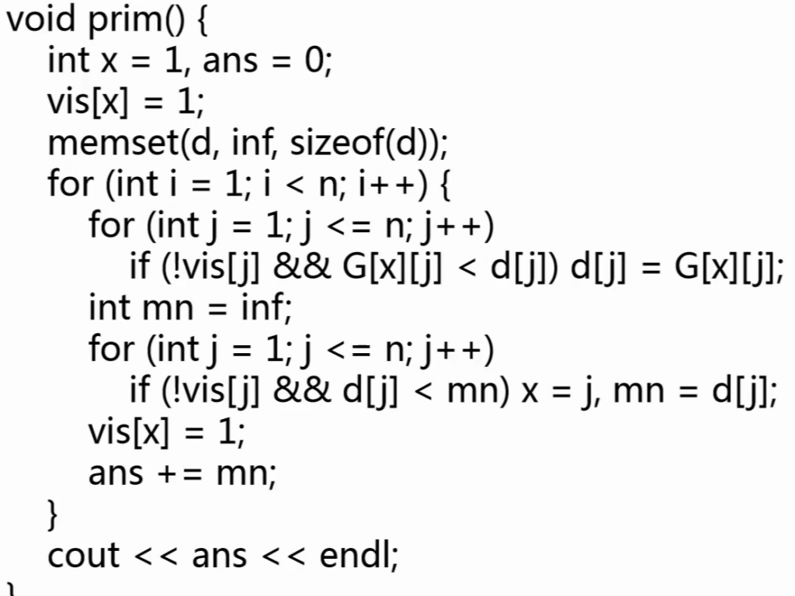

Prim 算法的思路和 Dijkstra 最短路算法非常相似，優化也基本相同。對於暴力做法中尋找最小值的步驟，可以使用優先隊列優化到 $O(n+m\log{m})$。

### Kruskal 算法

將邊權從小到大排序，一一嘗試向最小生成樹添加邊，若邊的端點不在同一個連通塊內，則添加，時間複雜度爲 $O(e\log{e})$。

代碼示例：

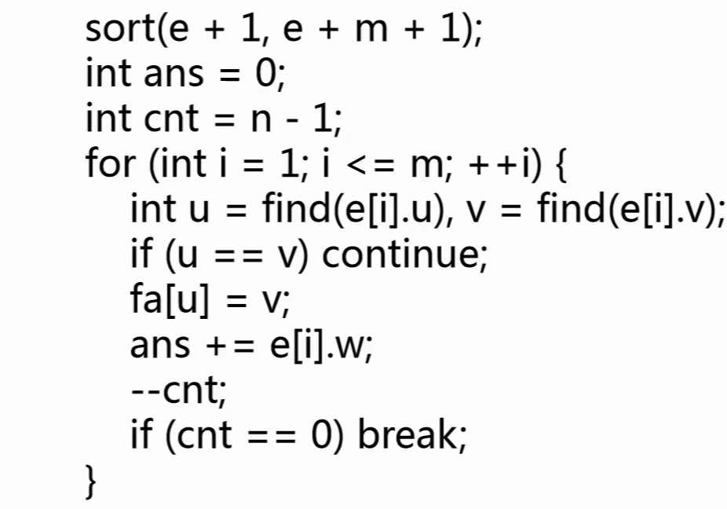

算法的正確性顯然，對於放棄的邊，其權值大於前面所有的邊，因此產生環時應當首先放棄。時間複雜度瓶頸在排序操作上。

**例題：HDU7226**

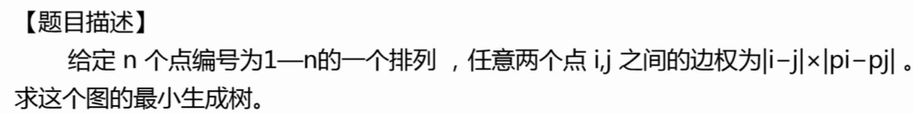

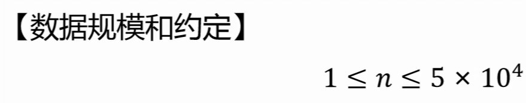

序列中所有數字之間的邊構成一個完全圖，但是不可能將這個完全圖實際建出來，空間和時間上都無法接受。

如果我們直接按順序連接所有點，那麼每條邊的邊權都小於 `n`。因此，最小生成樹中所有邊權都應當小於 `n`，也就是 $|i - j| * |p_{i}-p_{j}|$ 小於 $n$，兩個乘數有一個小於 $\sqrt{n}$。我們可以選擇枚舉 $i$ 在 1 到 n，$j$ 在 $i$ 到 $i+\sqrt{n}$，總時間複雜度爲 $O(n\sqrt{n})$。

然後對這些邊計算最小生成樹，因此疊加後的時間複雜度爲 $O(n\sqrt{n}\log{n}\sqrt{n})$。若時間複雜度較爲緊張，還可以使用桶排進行 Kruskal 中的排序過程，將 $\log{n}$ 壓縮。

**例題：洛谷 P2245 星際導航**

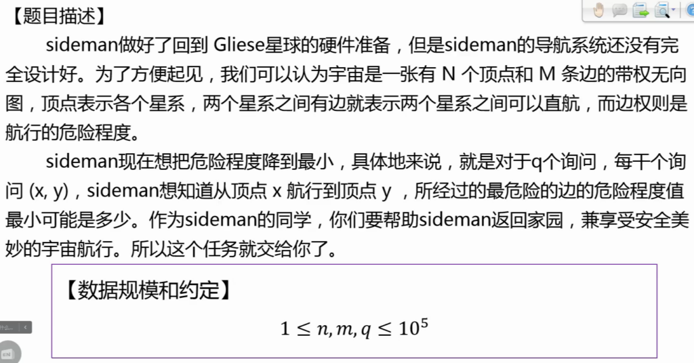

題意是尋找一條路徑上邊權的最大值。兩個點之間可能有很多邊，但是邊權較大的邊不會產生貢獻，因此我們先對圖運行 Kruskal 求最小生成樹，這樣兩個點之間有唯一路徑且一定最小（否則更短的邊會出現在生成樹中）。這樣就可以通過 LCA 直接求出總邊權。

另一種思路是使用 **Kruskal 重構樹**，適用於最小生成樹最大邊權問題。

Kruskal 重構樹的求解過程：

- 將邊權從小到大排序；
- 每次選擇邊權最小的一條邊，若其連接的兩個點已經進入集合，則跳過；否則，將這兩個點的祖先都連接到一個虛點上，點權爲這條邊的邊權。

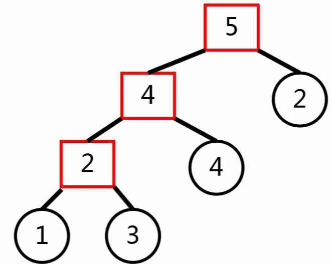

在這棵樹上，兩個節點之間的最大權值可以直接通過 LCA 求得，不需要單獨維護。某些題目只能通過重構樹的方式實現。

**例題：洛谷 P2619 邊的限制問題**

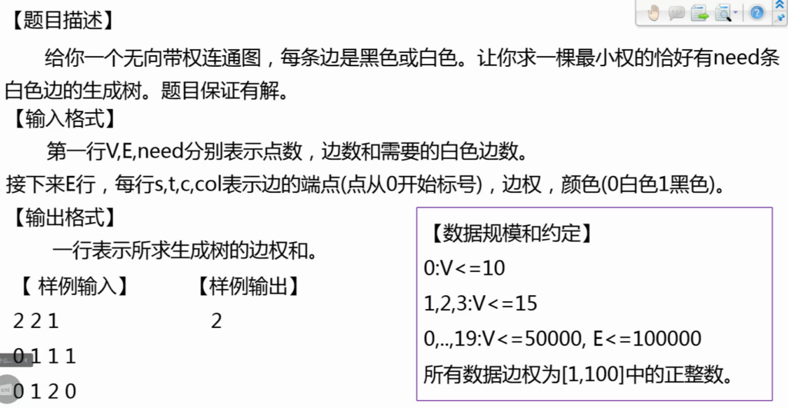

- 如果將所有白邊加一個很大的權值，則所有白邊都無法進入最小生成樹；
- 如果將所有白邊減一個很大的權值，則所有白邊都可以進入最小生成樹；
- 顯然，這個權值具有單調性，可以通過二分答案尋找分界點，此時就是題目所求的最小生成樹。

這種計算方法稱爲**帶權二分**，是很重要的思想。

**例題：洛谷 P4180 嚴格次小生成樹**

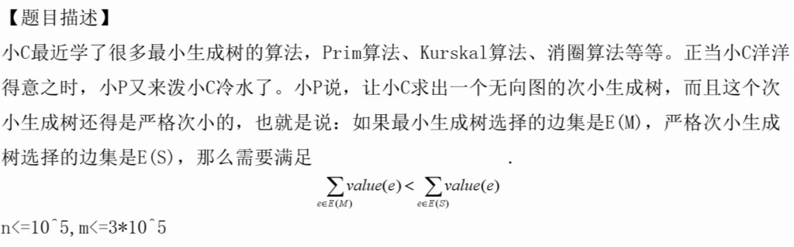

最簡單的思路是先求出最小生成樹，並每次刪除集合中的最大值，添加集合外的最小值。這種貪心的算法很簡單，但是不正確。

反例例如：

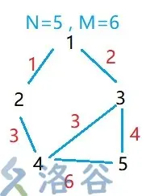

對於一個非嚴格次小生成樹，添加的邊權大於*等於*最小生成樹，因此不是嚴格次小生成樹。在添加新邊時，不僅要維護環上的最大值，還要維護次大值。對於最初的最小生成樹，進行倍增 LCA，分別記錄最大和次大值，並在此後添加邊時修改。

**例題：POJ2728 最優比率生成樹**

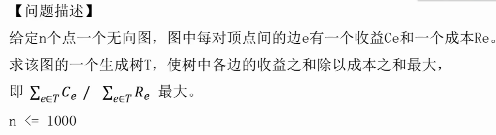

設比值大於等於 $k$，則可以變形爲 $k\Sigma{R}-\Sigma{C}\leq0$，拆分則爲 $(mid \times R_{1}-C_{1}) + (mid \times R_{2} - D_{2}) +\dots \leq 0$，可以二分求這個 $k$，並依次給邊賦值，求圖的最小生成時，邊權的和是否小於 $k$；若小於，說明 $k$ 偏小，反則偏大。

這個方法是解決 01 分數規劃的常見方法。

如果題意相反，是求最小值，則應當求最大生成樹。

## 連通性算法

**例題：洛谷 P1656 炸鐵路**

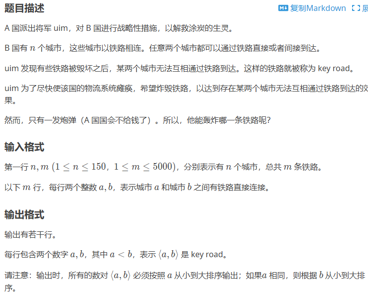

顯然是求**割邊**。

代碼：

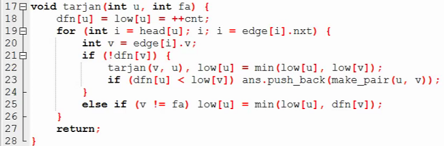

解釋：

- $dfn_{u}$ 是訪問到 $u$ 結點時的時間戳或順序；
- $low_{u}$ 是 $u$ 能回到哪一個點；
- 以上兩個值在 18 行初始化爲點本身；
- 尋找與 $u$ 直接相鄰的點，若這個點還沒有被訪問，則從這個點開始遞歸，並更新能夠回到的點；
- 如果一條邊是割邊，則它的兩個端點中一個的時間戳應當小於另一端能回到的點；
- 若這個點已經被訪問，則更新能回到的點。

對於求割邊，第 25 行的 $dfn_{v}$ 可以修改爲 $low_{v}$，本質上就是一次性更新了能到達的最遠祖先，可以跳過其間的點。

對以上代碼進行修改，可以求**割點（洛谷 P3388）**。

【待補充】

代碼：

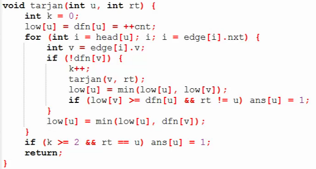

割點、割邊的概念主要是針對無向圖。

**強連通分量**是，在一個最大的無向圖中，任意兩點之間都有路徑。默認單個點是一個強連通分量。

求強連通分量的例子：

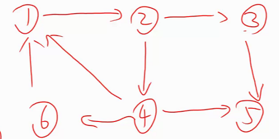

- DFS 找到 1，2，3，5，5 無法繼續，是強連通分量；
- 返回到 3，仍然無法繼續，是強連通分量；
- 返回到 4，深入到 4，發現可以回到 1，更新 $low$ 爲 1；
- 深入到 6，發現可以回到 1，更新 $low$ 爲 1；
- 回到 2，根據 4 更新 2 的 $low$ 爲 1；
- 回到 1，DFS 結束。

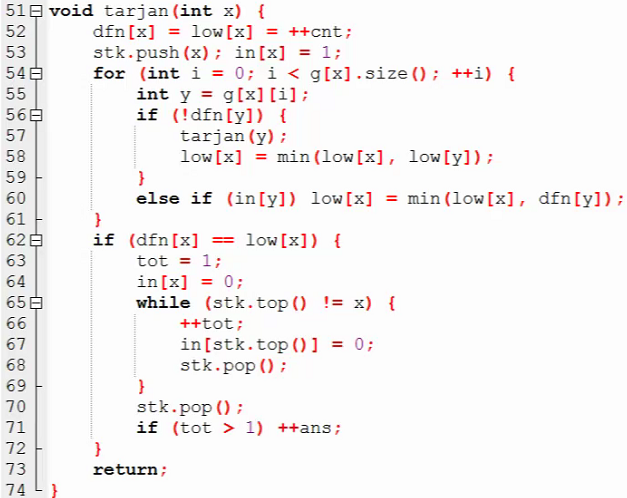

**例題：洛谷 P2272 最大半連通子圖**

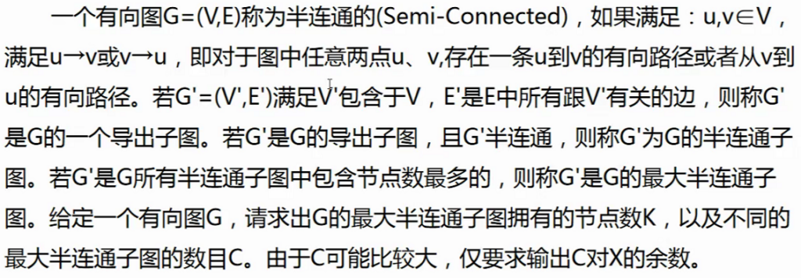

思路：首先將所有強連通分量求出，然後對它們進行縮點，形成一個 DAG，通過 DP 求 DAG 中的點權最大的路徑。

【點雙、邊雙連通分量跳過】

## 試題講評

**洛谷 P7991 Connect Two Barns S**

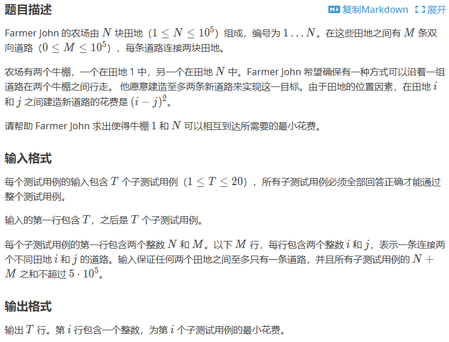

題意簡述：有一個不一定連通的圖，允許建立最多兩條邊，使 1 到 N 有路徑。

首先將圖分割爲若干連通塊，按數量分類：

- 有一個連通塊：直接輸出 `0`；
- 有兩個連通塊：加一條邊，一定有兩個相鄰的點，輸出 `1`；
- 有兩個以上的連通塊：包含 1 和 N 的連通塊分別連接到其他連通塊，求最小代價。

對於最後一個情況，枚舉每個點，並二分查找包含 1 和 N 的連通塊中最接近的點，求最小值。

**洛谷 P8191 Moo Network G**

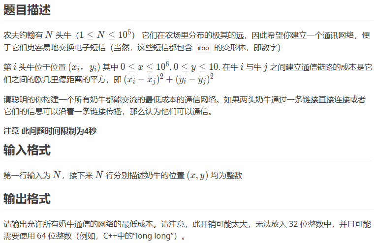

顯然是最小生成樹，如果全部建邊就成了上文所述。由於 $y$ 的值很小，實際上連邊只需要連 25 到 30 條邊就可以抵消較小的 $y$ 產生的影響。

**洛谷 P7528 Portals G**

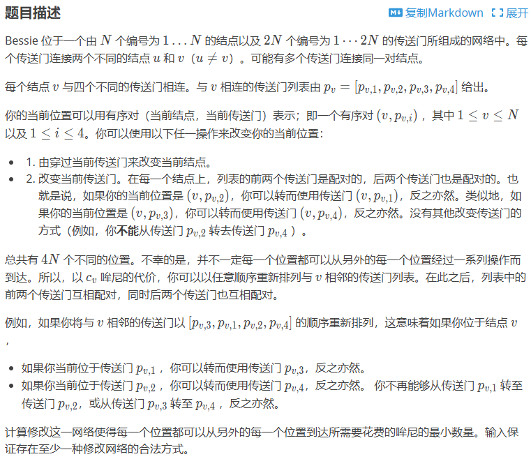

按照題意模擬，逐字理解。

**洛谷 P8328 Usmjeravanje**

題意簡述：給定一些有向邊和一些無向邊，要求確定邊的方向，使強連通分量數量最小。

【待補充】

## 下課！

又是被虐的一天！
