 😡 **太長不讀版**：使用 VLESS + WebSocket + TLS 方案、Cloudflare CDN 保護、Cloudflare WARP 解鎖服務，在 RackNerd 的 10.99/yr 起廉價服務器上搭建一個安全、隱私、不易封的代理服務器。無廣告，很詳細。如果您已經下定決心要自己搭建，請跳過 0x01 和 0x02 節。

> 本文如未特殊提及，貨幣單位均爲美元。好吧，其實是會被 KaTeX 識別成數學公式……

各位想必都已經混跡互聯網十餘載，對於這門技術有所耳聞，甚至自己購買過機場的訂閱，在外面的世界已經遨遊過一番了。今天本蛾子就講一個老生常談的問題：**老是覺得那些機場主都不可靠，我能不能自己搭一個？**

首先在文章開始之前，國際慣例，對於幾個常見誤解進行聲明：

- 本蛾子**熱愛中華人民共和國**，**熱愛中國共產黨**，**絕無污衊、詆譭國家、黨和人民的行爲**，本文的目的僅僅是技術分享，讀者您的行爲的後果由您自行承擔；
- 本蛾子沒有收一分錢；相反，還因爲購買服務器和域名花了 30 多，本文請放心食用；
- 搭建代理服務器是一個比較複雜的過程，您應當有最基本的 Linux 使用能力，對網絡相關知識有一定了解；
- 無論是自建的代理還是機場，總有被封或跑路的一天，您的錢若打了水漂，**本蛾子不負責**。

> 12 月 28 日更新：刪去了大段大段沒啥用的安全性分析。

## 👌 我知道了，開始吧

準備好了？讓我們先看看大概要做什麼。

- 購買 RackNerd 服務器（0x04 節）；
- 購買 Namesilo 域名並用 Cloudflare 託管（0x04 節）；
- 服務器初步設置，對於建站比較通用（0x05 節）；
- 搭建代理服務器，此時您已經可以使用代理了（0x05 節）；
- （可選）使用 Cloudflare 的 CDN 和 WARP 服務，對服務器前後流量進行優化（0x06 節）；
- （可選）安全性和速度提升（0x06 節）。

本蛾子趁着雙十一購買了服務器和域名，總價 27.86（¥200.87，按照支付寶和 Stripe 的匯率），如果您不幸地在沒什麼活動的時候看到這篇文章，也可以選擇到 RackNerd 社區去找找優惠，下面會說到。如果沒有什麼意外（不可能），搭建時間會在 30 到 40 分鐘。

## 💵 花錢

其實本蛾子一直都想哪次出國旅遊，把臺式機帶着，找個角落連上網線和電源，就這麼免費享受家寬加上超高性能。當然是瞎想了。

首先我們來到 [RackNerd](https://www.racknerd.com)。活動期間會有首頁橫幅，點擊進入即可。RackNerd 的老闆據說是華人，除了北美常見節日有活動，雙十一、春節等等國內節日也有，並且優點是續費可以原價。如果有可能的話，就在雙十一前後買，這樣到期之後重新購買，相當於免費換一個 IP。

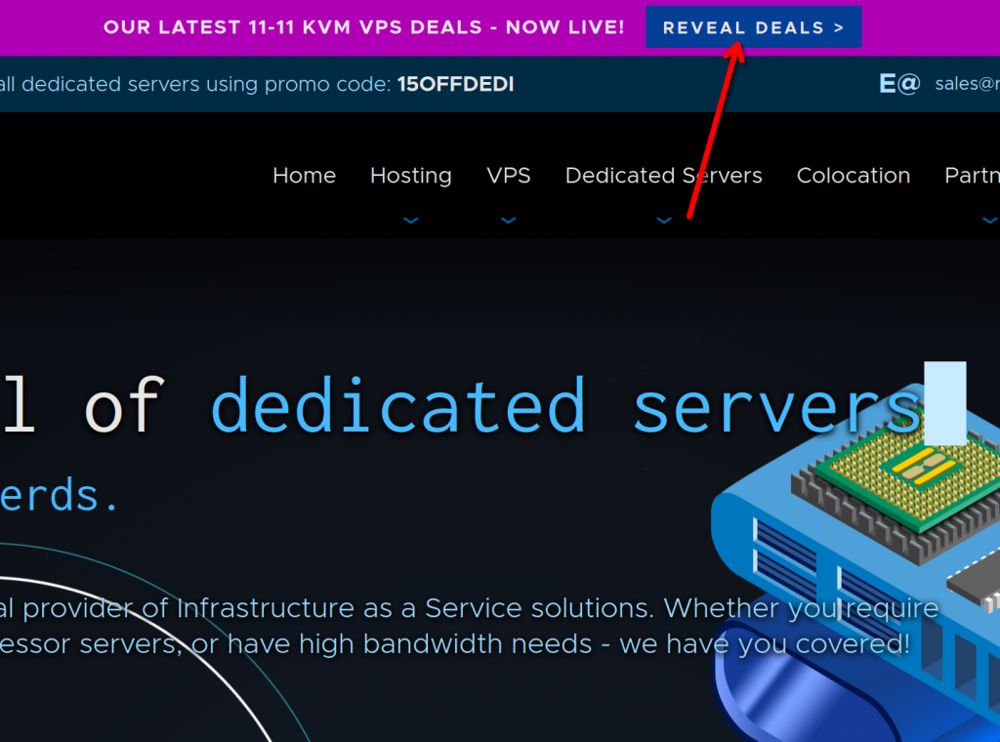

如果沒有活動，也可以去 [RackNerd 的社區活動](https://www.racknerd.club)，常年有優惠，最低價格 10.99，甚至比這個活動還要低。

無論如何，我們現在可以選擇四個套餐，具體配置大家可以自己看，這裏本蛾子推薦：

- 如果您沒有建站的需要，11.11 套餐足矣。
- 如果您希望在代理之外做點好玩的（WordPress、遊戲服務器等），建議購買 25.98 套餐。

注：這裏的價格是按照雙十一活動寫的，如果您查看的是社區活動，請相應選擇第一檔和第三檔套餐。爲啥？主要看以下幾個指標：

- 🧮 vCPU 和內存：這兩個決定了能跑多少服務以及性能，如果只是代理，1 vCPU 加上 1 GiB 內存綽綽有餘，但是如果有其他想法，尤其是內存容易捉襟見肘；
- 🛜 流量和帶寬：決定你一個月能用多少流量，最低的 1 TiB 都遠超機場了，但是注意這個流量包括您在服務器上下載的內容**和**發送的內容，也就是說您做代理的的用量會是兩倍，如果您要看什麼 8K 視頻，建議還是選大點的帶寬爲妙；
- 💾 硬盤：能存多少東西，RackNerd 是全 SSD 的，本蛾子跑過分，也說明如此，大可放心，至於容量，看您自己的需求；
- 🗺️ **位置**：重點來了，這是我們的場景下最重要的內容之一。RackNerd 只有一處 MC 機房（洛杉磯），其他均爲 CC（關於 MC 和 CC 區別請自行搜索），後者有時候會出現谷歌驗證碼、流媒體封禁的情況，而 11.11 套餐是沒有 Los Angles DC-02 選項的！並且洛杉磯有直通中國的電纜，因此速度上會比較好看，丟包也稍微少點，通過 RackNerd 的測試頁面來看，前後差距能達到 10 倍！但是 RackNerd 看來是超售了，晚高峯時間段還是會卡頓。

> 12 月 12 日更新：如果使用了下文所述的 WARP 代理，有一定幾率也會跳谷歌驗證碼，介意的話可以不開 WARP，或者多試幾次，找一個好的 IP 用。
>
> 12 月 28 日更新：是 WARP 的鍋，由於其默認使用 IPv6，提高了許多站點的敏感度，而且這些 IP 都是萬人共用，有追求的話可以購買 WARP+ 或者——換一家 VPS 吧。

關於地址再多說一點，千萬不要爲了省幾刀去買最便宜的套餐，垃圾線路對速度影響真的很大。如果您已經選擇了稍貴一點的線路，也請注意不要選錯位置，不然多花的錢就浪費了。

以下是一個示例，需要注意的地方本蛾子用紅框框標註了，大家自查：

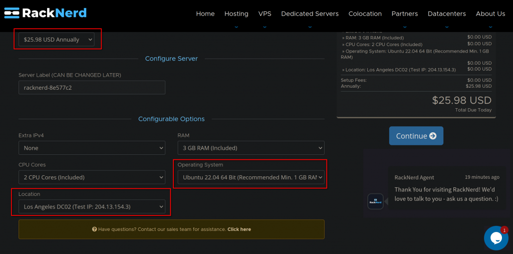

大家應該知道 Ubuntu 並不適用於服務器，但是我們這裏還是沒有選擇企業級 Linux 例如 Rocky Linux，主要有幾個原因：

- Rocky Linux 9 的 NetworkManager 更新需要手動操作，怕大家不大熟悉 Linux；
- Rocky Linux 的軟件包很舊，有些新的腳本用不了；
- Rocky Linux 預裝了比較麻煩的 SELinux，這是個好東西，但是在我們的情況下比較複雜且易導致錯誤。

> 12 月 28 日更新：其實用 Rocky Linux 也可以，文末添加了教程。不知道爲什麼 Ubuntu 的 SSH 總是一頓一頓的。

選好了服務器配置，接下來就可以付款了。記得選擇支付寶，用手機掃碼付款，然後註冊一個 RackNerd 賬號來管理，這些就不詳細說，相信大家是會的。付款之後，您填寫的郵箱會收到一封郵件，裏面包含了 VPS 的 root 密碼，以及他們 NerdVM 管理賬號。先不着急去連接，我們再來付錢買個域名。

域名嘛，我直接推薦大家去 [Namesilo](https://www.namesilo.com/) 註冊一個 .top，江蘇的一家公司運營，非常便宜，首年 1.88，續費 4.88，什麼 .com 之類的就別奢望了，價格普遍 20+。其實 [Spaceship](https://www.spaceship.com/) 有一些活動非常誘人，例如 .one 首年只要 0.98，但是次年要 23.98，所以……擦亮眼睛吧。

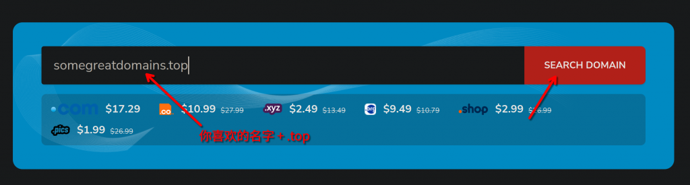

接下來，同樣註冊一個賬號，我們直接付款購買。

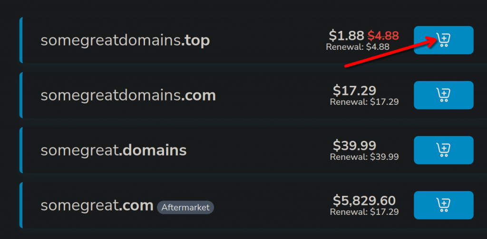

域名註冊好之後，我們馬上會將 DNS 記錄轉移到 Cloudflare 託管，但是由於 Cloudflare 的域名註冊沒有 .top 的授權，所以不能徹底轉移，後期的續費等操作還是要在 Namesilo 上操作。其實如果你只是想搭建一個代理，可以沒有域名，但是爲了證書和避免 IP 暴露，我們還是買一個爲好。

打開 [Cloudflare](https://www.cloudflare.com)，註冊之類的工作相信大家都會，就不細說了，完成之後我們看到賬戶主頁就有 Add a domain 的選項，我們點擊。

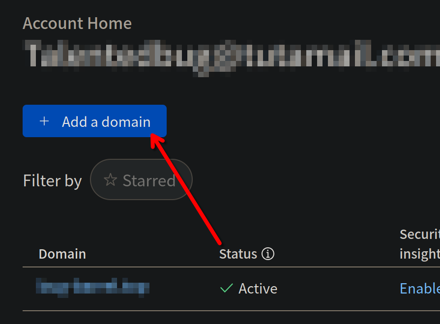

輸入你的域名，並根據提示在 Namesilo 將 DNS 服務器修改爲 Cloudflare 提供的兩個。要說 Namesilo 的管理界面是真的古舊，算了算了，還是給大家演示一下怎麼修改 DNS 記錄吧。

首先，在用戶的 Dashboard 上打開域名管理。

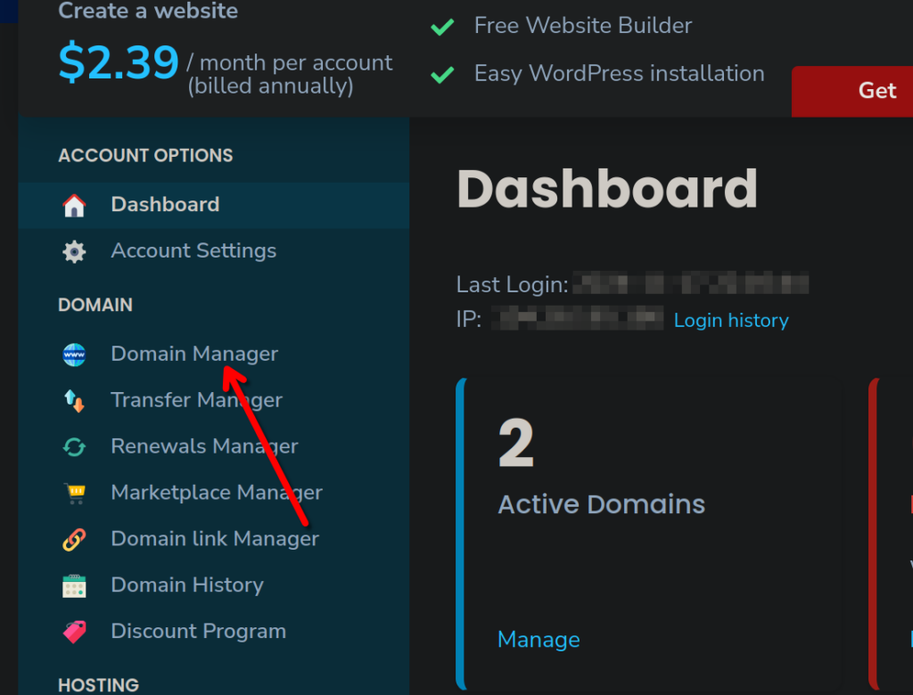

然後選擇我們剛剛購買的域名，右側有一個疑似數據庫管理的圖標——實際上是 DNS 服務管理。

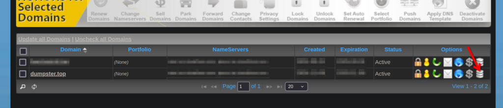

然後我們刪除原來所有的 DNS 服務器，並添加 Cloudflare 提供的服務器。

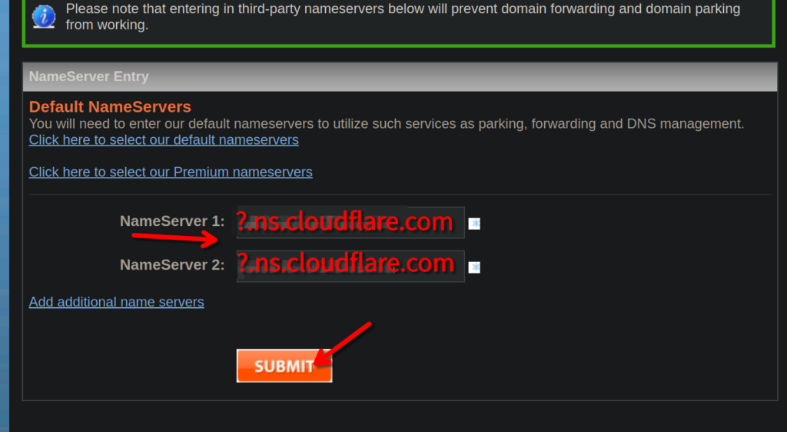

這時候我們回到 Cloudflare（是的，接下來**基本**可以和 Namesilo 這個醜陋的界面說再見了），等待 Cloudflare 的 DNS 信息更新，過一會兒我們就能看見成功的提示了。

關於 Cloudflare 服務的用法還有很多（大善人的名號不是白叫的），目前的設置應該夠用了，本蛾子過段時間可能再寫一篇文章，說說怎麼用 Cloudflare 的服務給自己的網站增加安全性。（致各位信奧賽選手：如果您的機房採用了極域、育林衛、（舊版）聯想以及很多舊的網絡控制系統，讓您無法上網（但是可以看到一個阻止頁面），那麼 DNSSEC 能讓您的網站正常使用（防止 DNS 污染）。）

## 0x05 建站

現在我們可以翻出剛剛 RackNerd 的那封郵件了。簡單閱讀一下，最重要的信息是兩個：

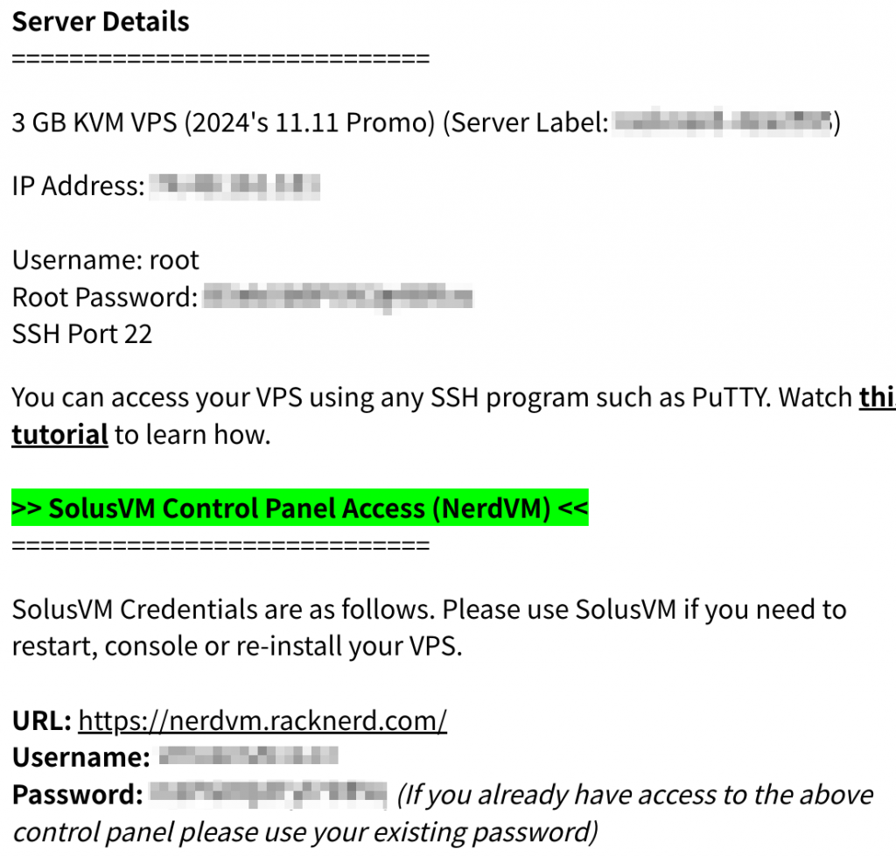

- IP 地址和用於 SSH 的用戶名和密碼；
- NerdVM 賬戶。

後者我們暫時還是用不到，所以先彆着急刪除郵件。如果您使用 Windows，打開 PowerShell；如果您使用 Linux——這還需要本蛾子教您嗎？總之打開一個現代的終端，幾乎所有平臺都已經有了 OpenSSH。我們使用以下命令連接：

```
$ ssh root@[YOUR_IP_ADDRESS]
```

嗯……有問題嗎？前面那個 `$` 不是命令的一部分啦，是說您要用普通用戶執行！`[YOUR_IP_ADDRESS]` 是剛剛看到的 IP 地址！

本蛾子說過您需要最基本的 Linux 知識。

如果您是首次連接，那麼會出現詢問您是否保存指紋的提示，直接輸入 `yes` 即可。然後輸入剛剛的 root 密碼，密碼是不顯示的，輸完之後直接按回車，如果輸出了按住退格一會兒，清空輸入，如果幹脆不想連接了直接按 Ctrl-C 中止。

不出意外，一長串信息將會歡迎您：

```
Welcome to Ubuntu 22.04.5 LTS (GNU/Linux 5.15.0-125-generic x86_64)

 * Documentation:  https://help.ubuntu.com
 * Management:     https://landscape.canonical.com
 * Support:        https://ubuntu.com/pro

 System information as of ***

  System load:  ***                Processes:             ***
  Usage of /:   ***                Users logged in:       ***
  Memory usage: ***                IPv4 address for eth0: ***
  Swap usage:   ***

 * Strictly confined Kubernetes makes edge and IoT secure. Learn how MicroK8s
   just raised the bar for easy, resilient and secure K8s cluster deployment.

   https://ubuntu.com/engage/secure-kubernetes-at-the-edge

Expanded Security Maintenance for Applications is not enabled.

*** updates can be applied immediately.

Enable ESM Apps to receive additional future security updates.
See https://ubuntu.com/esm or run: sudo pro status
```

這段文字裏包含了系統信息、版本，當前狀態，還有，咳咳，Ubuntu 的廣告。

下面會出現一個您可能很熟悉的東西——剛剛輸入 SSH 命令的時候見過？

```
root@racknerd-***:~# 
```

這就是命令提示符了，您後面的命令都需要這樣輸入。但是現在我們通過 root 登錄，還用 SSH，這是非常危險的，所以第一步是建立一個有 sudo 權限的普通賬戶，並且禁止 root 通過 SSH 登錄。

```
root@racknerd-***:~# useradd -m -G sudo admin
```

添加一個名爲 `admin` 的用戶，並分配進入 `sudo` 組。注意似乎除了 Ubuntu 沒人把特權組叫作 `sudo`，不是都叫 `wheel` 嗎？

```
root@racknerd-***:~# passwd admin
New password:
Retype new password:
passwd: Password updated successfully
```

在提示輸入新密碼的地方輸入，然後重複一遍。注意仍然是不顯示的。

在修改 SSH 設置之前，我們先測試一下，防止設置有問題，待會兒就沒法通過 root 連接服務器了。

```
root@racknerd-***:~# su - admin
admin@racknerd-***:~$ 
```

注意到提示符的變化了嗎？我們進入了普通用戶模式。

```
admin@racknerd-***:~$ sudo apt --version
[sudo] password for admin: 
```

輸入您剛剛設置的密碼，你應該可以看到 APT 的版本信息，但是如果你看到的是：

```
admin is not in the sudoers file.
```

說明你剛剛的設置存在問題，比如沒有加入 `sudo` 組。

如果沒有什麼問題，接下來我們就可以禁用 root 的 SSH 登錄了。

```
admin@racknerd-***:~$ sudo vim /etc/ssh/sshd_config
```

路徑名稱可以使用 Tab 補全。如果您不會使用 Vim，請自行在網上搜索一下，有很多相關的教程，這裏只需要關注兩個：

- 正常模式（啓動時）下輸入 `i` 進入輸入模式；
- 按下 `<esc>` 退出輸入模式，回到正常模式；
- 正常模式下輸入 `/` 搜索，回車到達；
- 結束編輯之後，在正常模式下輸入 `:wq` 退出 Vim 並保存。

很簡單吧！我們這裏只需要查找到 `PermitRootLogin` 這個設置，將之後的 `yes` 修改爲 `no` 就行，然後退出 Vim，並重啓 sshd 服務：

```
admin@racknerd-***:~$ sudo systemctl restart sshd
```

然後輸入 `exit` 並重新用 `admin@[YOUR_IP_ADDRESS]` 連接，這樣您使用的就是普通用戶了。

> 12 月 28 日更新：如果您想進一步防止 SSH 暴力破解密碼，請按[使用 SSH 公鑰登錄服務器並禁用密碼](https://hi.bug-barrel.top/posts/5baaf9322f/)的說明操作。

最基本的事情做完了，接下來我們來更新一下。目前 RackNerd 提供的最新版本是 22.04 LTS，最新的則是 24.04 LTS，您千萬不要動心去 `do-release-upgrade`，主要是因爲我們畢竟不在服務器跟前，防止出現什麼問題我們無法調試。什麼？需要換源嗎？開玩笑，我們的服務器可是在美國！

```
admin@racknerd-***:~$ sudo apt update && sudo apt upgrade
```

更新完成，由於我們沒有 Live Patch 之類的高科技，還是需要老老實實地重啓：

```
admin@racknerd-***~$ sudo reboot
```

稍等 1 分鐘，再次連接，Ubuntu 的軟件包就是最新的了！

接下來，我們就開始代理的搭建了。其實最好是要自己手動搭建，畢竟那些 N 合一的腳本出過一些掛馬、挖礦的~~幺蛾子~~醜聞，但是這裏爲了方便（絕對不是本蛾子沒搭建成功），我們還是採用一個本蛾子驗證過且很有名的腳本：[233boy/v2ray](https://github.com/233boy/v2ray)，~~這樣一死一大片~~。

首先下載腳本：

```
wget https://raw.githubusercontent.com/233boy/v2ray/refs/heads/master/install.sh
```

執行，安裝：

```
bash install.sh
```

這時候腳本會直接給出一個鏈接，但是暫時不要使用，因爲它是純 VLESS，沒有加密，沒有 CDN，也沒有配置我們花費 1.88 鉅款買的域名來防止 IP 泄露。我們再次打開面板：

```
sudo v2ray change
```

然後輸入 `1` 更改協議，輸入 `8` 選擇 VLESS + WS + TLS。選擇 WebSocket 作爲加密是因爲 Cloudflare CDN 只支持 WS。

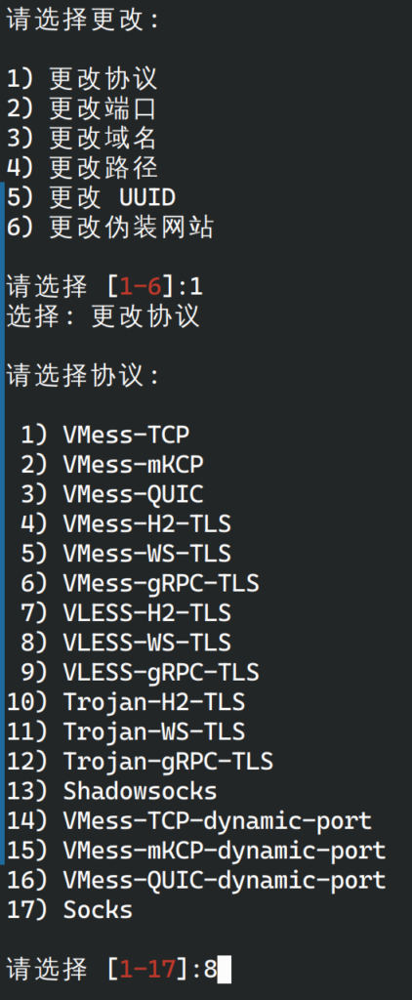

然後便又一次給出一個訂閱鏈接。這個鏈接其實已經可以使用了，但是建議還是不要連接，否則特徵流量太多容易被封。

我們回到 Cloudflare 將域名（可以是子域名）解析到服務器 IP，注意這時候不要開啓小黃雲，否則腳本無法驗證域名是否能到達服務器。

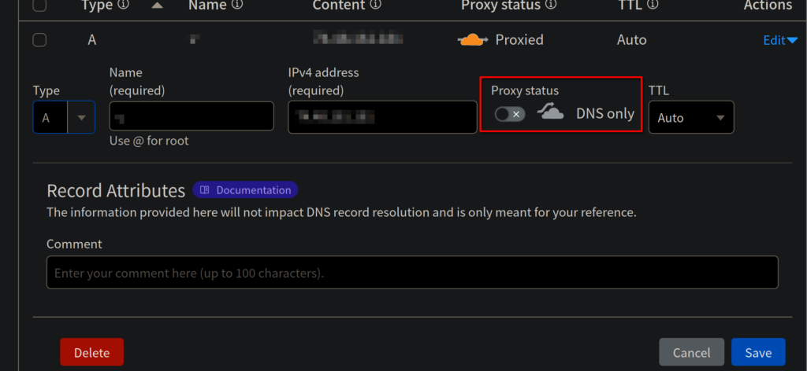

再次使用 `sudo v2ray change` 打開修改面板，選擇 `3` 更改域名，輸入上述域名，這時候可以發現給出的訂閱鏈接又有變化，但是依然不要使用。

再再次使用 `sudo v2ray change`，我們來換個端口，考慮到大家可能會用服務器來建站，所以我們儘量不要佔用 443 端口，而是使用 Cloudflare CDN 支持的端口，根據您的情況，可以修改爲：2053，2087，2096 或者 8443。給出的鏈接依舊不要使用。

再再再回到 Cloudflare（讀者：你有完沒完），打開小黃雲。好了，你可以使用上一步的代理鏈接了。

什麼？您手滑把終端 `clear` 了？這麼不小心，肯定和本蛾子沒關係。使用 `sudo v2ray i` 查看配置就行了。

> 12 月 28 日更新：如果您不小心把原來的 SSH 公私鑰丟了，上述命令能讓您在無法顯示中文的 VNC 中直接查看訂閱信息。

## ⚙️ 優化

到這時候我們安全的問題就基本解決了。我們的請求現在是這樣的：

- 您的客戶端發送請求到 Cloudflare 邊緣服務器（過牆，HTTPS 加密，常規流量）；
- Cloudflare 邊緣服務器發現 CDN 沒有緩存（那肯定的），發送請求到服務器（牆外，TLS 加密，常規流量）；
- 服務器的 v2ray 接收到請求，將數據包發送回 Cloudflare 邊緣服務器（牆外，TLS + WS 加密，VLESS 特徵流量）；
- Cloudflare 邊緣服務器將您的數據發送回客戶端（過牆，HTTPS + TLS + WS 加密，VLESS 特徵流量）。

可以發現，我們的客戶端和服務器都**只與** Cloudflare 邊緣服務器進行通信，本質上和您訪問 Cloudflare Dashboard 沒有區別。但是還有一點：您的服務器 IP 是 IDC 機房 IP，非常髒，有些流媒體服務無法使用。因此我們可以在服務器端再次部署一個 WARP 代理，使用 Cloudflare 的 IP 獲得更好的純淨度。

```
wget https://gitlab.com/fscarmen/warp/-/raw/main/menu.sh
```

接下來，運行腳本：

```
bash menu.sh
```

第一個選項選擇 `3`，剩餘的保持默認即可。不出意外，您的服務器將可以連接 WARP 網絡，獲得一個（大概率）IPv6 地址。恭喜您，最後一塊磚，填上了！

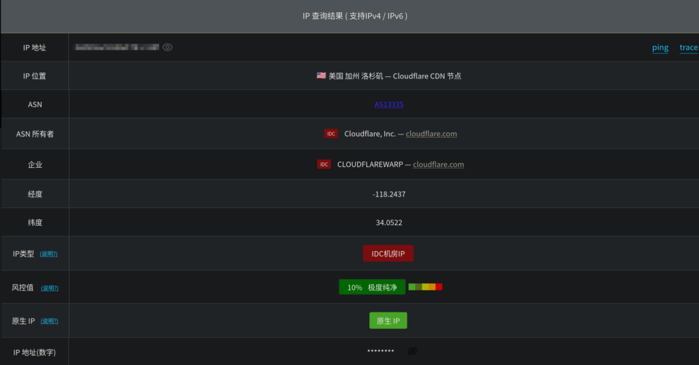

還是很不錯的。

您現在應當可以觀看 YouTube+、Disney+ 和 Netflix 非自制劇。如果您是維基人，那麼很遺憾，Wikipedia 的編輯還是無法解鎖，並且 MediaWiki 不知道有什麼魔法，能識別兩個 IP，您獲得了一個雙重封禁！

> 12 月 28 日更新：剛剛運行 v2ray 的時候不要着急啓動 WARP，這將導致 Caddy 自動獲取證書失敗。後期如果發現沒法連接，也可以回來關掉 WARP，重啓 Caddy，獲取成功之後再啓動。

## ✏️ 後記

其實這篇文章到這裏還沒有結束。服務器管理本身就是很複雜的工作，如果您還想建站，那又是很複雜的工作。您現在想必已經可以自由訪問，雖然晚高峯時段部分站點存在卡頓，但是整體還是很不錯的。

最後，提醒您：外網可供您學習、娛樂，但是如果您不是隱私大佬，請不要貿然使用您的任何真實信息和國內身份註冊任何服務，或者在網站上發表不當言論。本蛾子是 OIer，外網對本蛾子的吸引力集中在 Stack Overflow、GitHub、Google Scholar 和 Wikipedia，而您，我不知道爲啥會想上外網。


## ⛰️ 附錄：RHEL 系發行版指南

如果您是 RHEL 忠實用戶、想使用 SELinux 或者就是不喜歡 Ubuntu，那麼本指南的大部分內容依舊適用，有幾點需要注意。

- 特權組名稱爲 `wheel` 而非 `sudo`。

- 如果您計劃禁用密碼登錄，請勿設置 `UsePAM no`。

- 默認啓動 `firewalld`，出於安全考慮，請不要按照網上的教程直接關閉，放行部分端口即可：

  ```bash
  $ sudo firewall-cmd --add-port=2053/tcp --permanent # 2053 改爲您在一鍵腳本里設置的端口號
  $ sudo firewall-cmd --add-port=2053/udp --permanent # 別忘了 UDP
  $ sudo firewall-cmd --reload # 所有未加 --permanent 的規則會失效
  ```

- SELinux 會阻止 v2ray 使用 443 端口。在做其他事兒的時候也經常會干涉，硬控本蛾子的調試時間。這玩意兒本蛾子也玩不轉，據說是 Linux 權限系統的補充，所以還是把它關掉吧：

  ```bash
  $ sudo vim /etc/selinux/config
  # 將 SELINUX=enforcing 改爲 SELINUX=disabled
  $ sudo reboot # 必須重啓
  ```

  > 調試 SELinux 導致本蛾子的服務下線時間比 DDoS 還長，於是就自暴自棄了 😮‍💨

- 某些額外的包沒有預裝，按照報錯 `sudo dnf provides [name]` 再 `sudo dnf install [name]` 即可。

- RackNerd 提供的 Rocky Linux 和 AlmaLinux 首次更新的時候由於 network-scripts 被棄用，會報錯，添加 `--allowerasing` 參數即可。

  > 12 月 28 日更新：Rocky Linux 更新導致三四個包都出了問題，本蛾子也不能打包票好用。建議轉換至 AlmaLinux，處理起來比較簡單。

