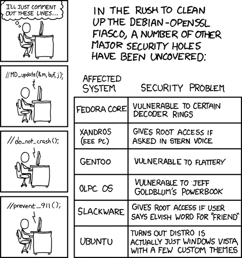

😠 **太长不读**：生成 SSH密钥，上传到服务器，然后禁用密码登录。（好像是废话）

## 0x01 🔒 生成 SSH 密钥

> 以下使用 `$` 符号代表本机执行，`>` 符号代表服务器执行。

```
$ ssh-keygen # 旧版本需要添加 `-t ed25519` 参数
Generating public/private ed25519 key pair.
Enter file in which to save the key (/home/YOUR_USER_NAME/.ssh/id_ed25519): # 可以自定义位置，也可以直接回车
Enter passphrase for "example" (empty for no passphrase): # 输入密码（不显示），不建议空密码
Enter same passphrase again: # 再输一遍
Your identification has been saved in id_ed25519
Your public key has been saved in id_ed25519.pub # 带有 .pub 的是公钥
The key fingerprint is:
SHA256:SOME_STRANGE_STRING YOUR_USER_NAME@YOUR_HOST_NAME # 你的公钥指纹
The key's randomart image is: # 根据公钥生成的随机图像
+--[ED25519 256]--+
|       SOME      |
|     STRANGE     |
|      IMAGE      |
|                 |
|                 |
|                 |
|                 |
|                 |
|                 |
+----[SHA256]-----+

$ ls .ssh
id_ed25519 id_ed25519 # 可能还有其他文件
```

## 0x02 ⬆️ 上传到服务器

首先确保你当前可以使用密码登录一个**非 root** 的账号。

```
$ ssh example_user@example_host
example_user@example_host's password: 
>
```

然后，退出 SSH，在本机上执行（注意是本机）：

```
$ ssh-copy-id -i .ssh/id_ed25519.pub example_user@example_host
```

在上传过程中，会要求你输入当前密码。一般来说很快就会上传完成。

测试一下是否可以登录。

```
$ ssh -i .ssh/id_ed25519.pub example_user@example_host
.ssh/id_ed25519.pub's password: # 注意这里变成输入密钥的密码了
>
```

如果可以，继续下一步。

## 0x03 🙅‍♂️ 禁用密码登录

```
> sudo vim /etc/ssh/sshd_config
```

在编辑器中，添加或修改以下选项：

```
PasswordAuthentication no
PermitRootLogin no
AllowPAM no
AllowUsers example_user # 可选，这将禁止除 example_user 之外任何用户 SSH 登录
```

保存并退出，然后：

```
> sudo systemctl restart sshd
```

退出 SSH，再次尝试登录：

```
$ ssh example_user@example_host
example_user@example_host: Permission denied (publickey).
```

再次使用密钥登录，如果登录成功，那么说明以上步骤都是正确的！

> ❓ 如果不行呢？恭喜你 🎉 你被锁在系统之外了！VNC 你的服务器吧……
>
> 
>
> 来源：[XKCD](https://xkcd.com/424/)，原文解说是 *True story: I had to try several times to upload this comic because my ssh key was blacklisted.*。

