我還是希望大家啊，多用歪克特，啊，尤其是我們現在有了，啊，凹凸，簡潔而且方便。

> 本文中若無特殊說明，認爲樹的根節點的深度爲 1。

## 樹的直徑

樹上任意兩個點之間的最長距離稱爲樹的直徑。

求樹的直徑，可以從任何一個節點 $x$ 開始 DFS，能到達的最遠節點 $y$ 一定是直徑的一端。再從 $y$ 開始 DFS，能到達的最遠節點 $z$ 就是直徑的另一端，$x$ 與 $y$ 的距離即爲直徑。

證明：

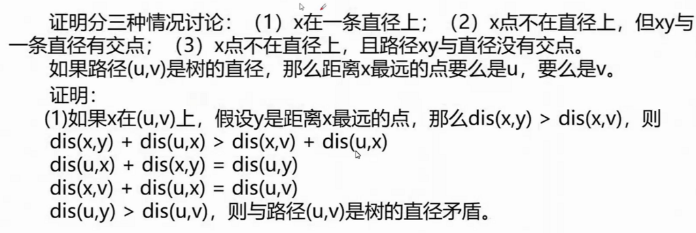

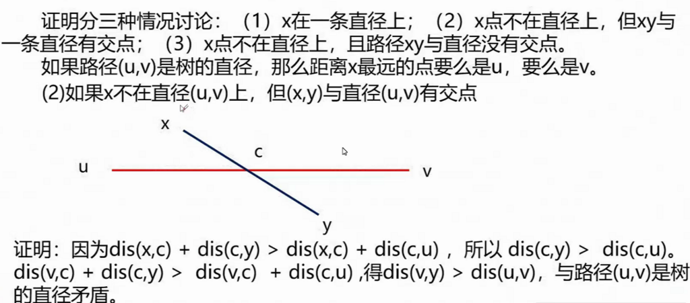

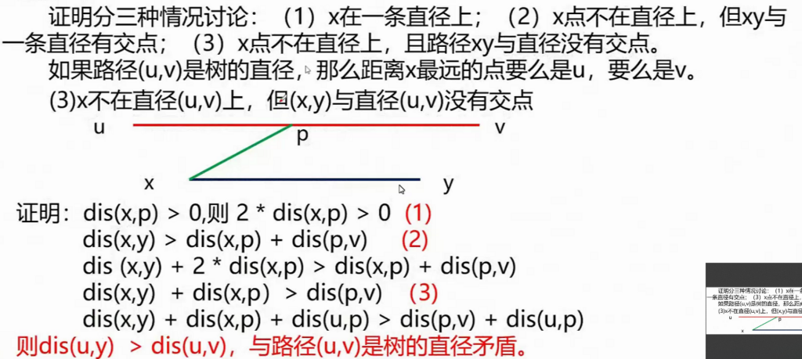

代碼：

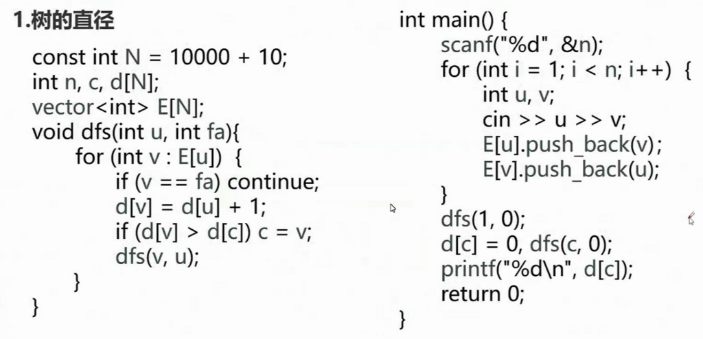

樹的直徑也可以使用樹形 DP 計算，若設 1 爲樹根，那麼設某個點向下能達到的最大和次大值是 $d1$ 和 $d2$，那麼 $d1 + d2$ 最大時就是樹的直徑。

代碼：

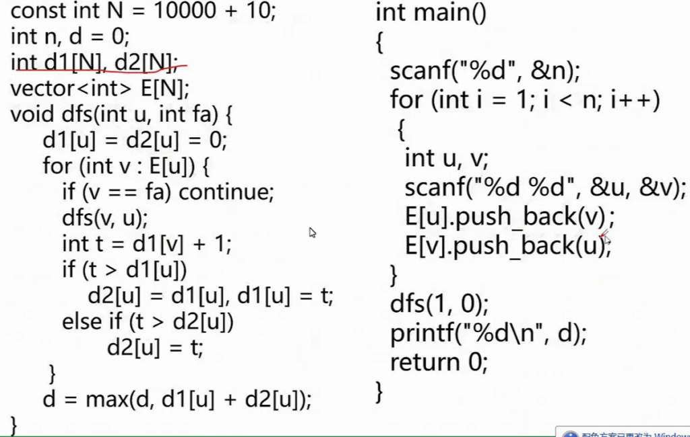

上述寫法也可以壓縮爲一個數組，定義 $dp_{u}$ 是以 $u$ 爲樹根的子樹中，從 $u$ 出發的最長路徑，那麼有轉移方程 $dp_{u}=\max{dp_{u}, dp_{v}}$，其中 $v$ 是 $u$ 的子節點。對於求直徑的過程，我們可以在轉移時打擂求最大值。

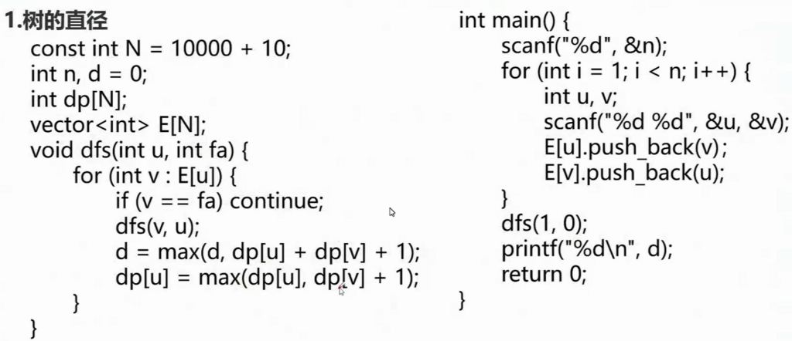

## 樹的中心

選定一個點作爲樹的根節點，使得葉節點到根節點的最大距離最小，這個點稱爲樹的中心。

樹的中心一定在直徑上，且趨於兩個端點的中點，因此可以在找出直徑的同時，求出其到每個節點的距離。

代碼：

```
#include<cstdio>
#include<iostream>
#define re register
#define maxn 100010
using namespace std;
inline int read()
{
	int x=0,f=1; char ch=getchar();
	while(ch<'0'||ch>'9'){if(ch=='-')f=-1;ch=getchar();}
	while(ch>='0'&&ch<='9'){x=x*10+ch-'0';ch=getchar();}
	return x*f;
}
struct Edge{
	int v,w,nxt;
}e[maxn<<2];
int x,y,z;
int pos1,pos2,d[maxn],d1[maxn],d2[maxn];
int n,tmp1,tmp2,tmp3,ans,pos,cnt,head[maxn];
inline void add(int u,int v,int w)
{
	e[++cnt].v=v;
	e[cnt].w=w;
	e[cnt].nxt=head[u];
	head[u]=cnt;
}
void dfs1(int u,int fa,int dis)
{
	for(int i=head[u];i;i=e[i].nxt)
	{
		int ev=e[i].v;
		if(ev==fa) continue;
		dfs1(ev,u,dis+e[i].w);
	}
	d[u]=dis;
	if(dis>tmp2) tmp2=dis,tmp1=u;
}

int main()
{
	n=read();
	for(re int i=1;i<n;++i)
	{
		x=read(),y=read(),z=read();
		add(x,y,z);
		add(y,x,z);
	}
	dfs1(1,0,0);
	pos1=tmp1;
	tmp2=0,tmp1=0;
	dfs1(pos1,0,0);
	pos2=tmp1;
	tmp2=0,tmp1=0;
	//找到直徑了 
	for(re int i=1;i<=n;++i) d1[i]=d[i];
	dfs1(pos2,0,0);
	for(re int i=1;i<=n;++i) d2[i]=d[i];
	ans=0x3f3f3f3f;
	for(re int i=1;i<=n;++i)
	{
		if(ans>max(d1[i],d2[i]))
		ans=max(d1[i],d2[i]),pos=i;
	}
	printf("%d %d",pos,ans);
	return 0;
}
```

## 樹的重心

選擇樹中的一個節點並刪除，使得分成的所有子樹的最大節點數最小，這個點稱爲樹的重心。樹的重心若不唯一，則一定有兩個。

代碼：

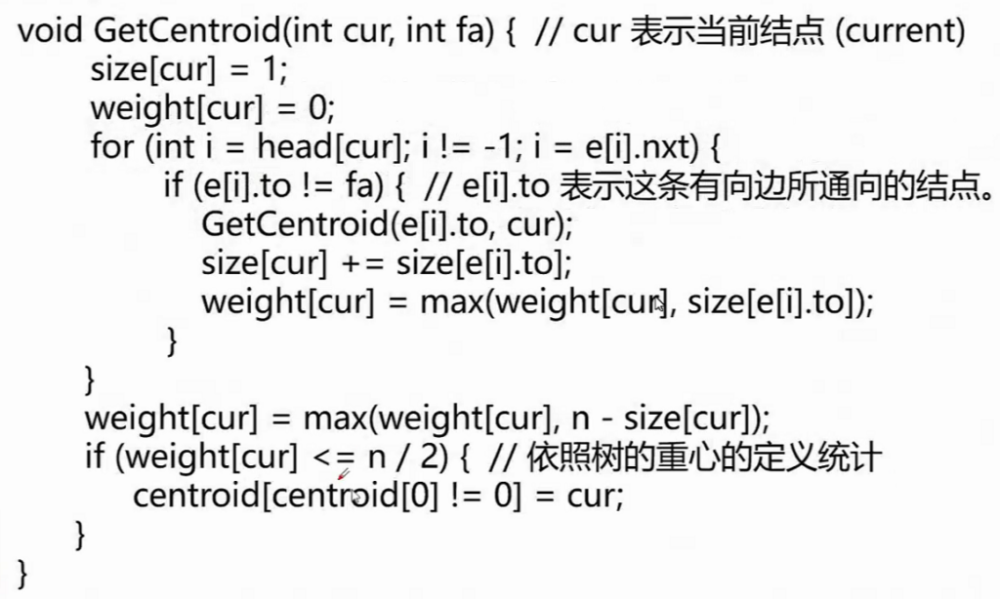

## 最近公共祖先

求最近公共祖先的樸素方法是，先讓較深的節點向其父親跳，直到深度相同，然後兩個節點同時向上跳，直到相遇，時間複雜度 $O(n)$。

對於樸素算法的上跳過程，可以通過倍增進行優化。通過預處理 $fa$ 數組，將原本的跳躍次數 $y$ 分爲其二進制位對應的跳躍。預處理時間複雜度 $O(n\log{n})$，查詢時間複雜度 $O(\log{n})$。

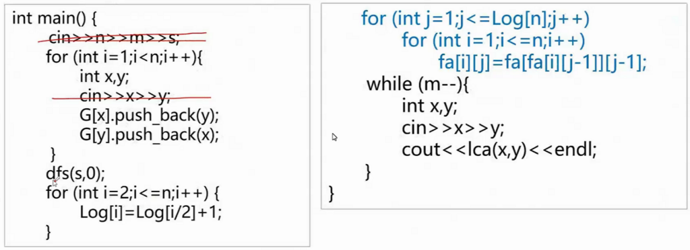

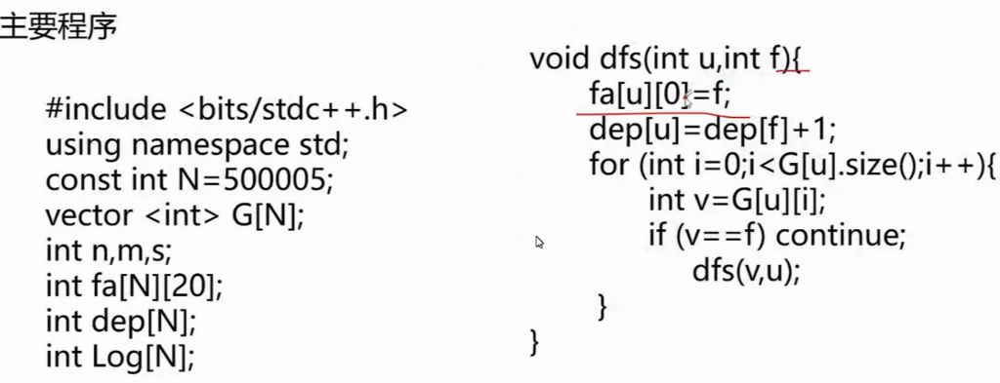

## 樹上差分

**例題：洛谷 P3128 Max Flow P**

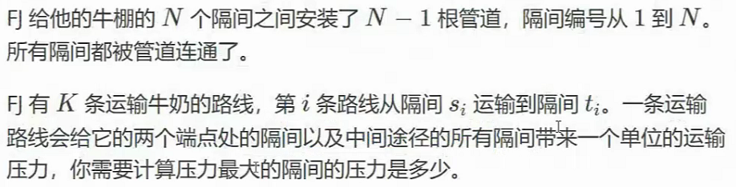

對每條路徑的起點和終點求 LCA，將路徑上所有邊的權值都加 1，然後求邊權最大值。但是如果真的一一添加會超時，可以使用樹上差分進行優化。

需要注意由於樹上差分若對於 $w_{a}$ 和 $w_{b}$ 均加上 1，處於路徑交匯點的 LCA 實際上加 2。爲了抵消影響，需要對 $w_{lca}$ 減去 1；同時由於填充實際數值時會將 $w_{lca}$ 的變化向上波及，還需要對 $w_{fa_{lca}}$ 減去 1，抵消影響。

## 樹上貪心

**例題：ABC333D**

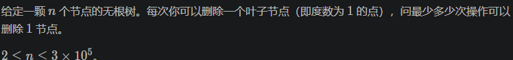

由於我們希望刪除的點最少，因此保留的子樹一定是最大的，在每次刪除時貪心地選擇最小的子樹即可。

## 樹上 DP

**例題：洛谷 P1122**

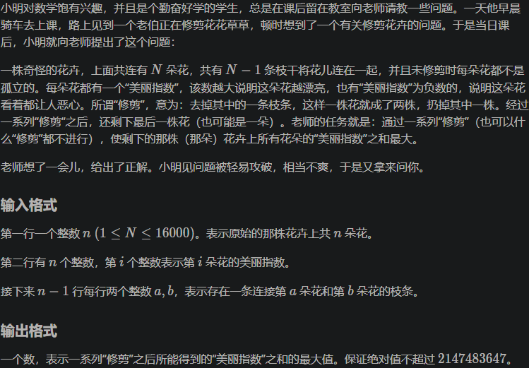

樹上 DP 的基本思路是將子樹的狀態轉移到根節點上。

代碼：

```
#include <cstdio>
#include <algorithm>
#include <vector>
using namespace std;
int n,a[16005],f[16005],ans=-2147483647;
vector <int> E[16005];
void dfs(int u,int fa)
{
    f[u]=a[u];//f初始值
    for(int i=0;i<E[u].size();i++)
    {
        int t=E[u][i];
        if(t!=fa)
        {
            dfs(t,u);
            if(f[t]>0)
                f[u]+=f[t];//如式
        }
    }
}
int main()
{
    scanf("%d",&n);
    for(int i=1;i<=n;i++)
        scanf("%d",&a[i]);//點權輸入
    for(int i=1;i<n;i++)
    {
        int u,v;
        scanf("%d%d",&u,&v);
        E[u].push_back(v);
        E[v].push_back(u);//vector雙向連邊
    }
    dfs(1,0);
    for(int i=1;i<=n;i++)
        ans=max(ans,f[i]);//找出最大點權和
    printf("%d",ans);
    return 0;
}
```

## 樹上揹包

**例題：P2014 選課**

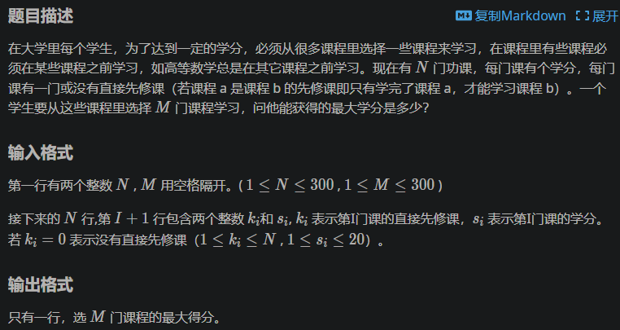

由於本題沒有給出作爲樹根的節點，可以將 0 作爲虛根，設 $dp_{i,j}$ 表示前 $i$ 個子節點、選擇 $j$ 門課，滾動數組壓縮樹根的維度。

## 換根 DP

**例題：ABC348E**

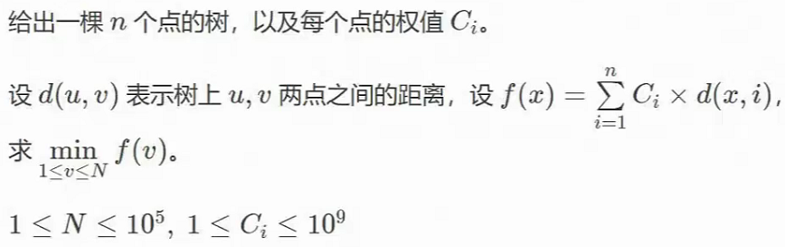

本蛾子集訓五天以來第一道一遍 AC 的題目！

- 第一次 DFS，初始化深度、LCA 倍增數組；
- 第二次 DFS，求每個節點及其子樹的權值和；
- 第三次 DFS，求以 1 爲根的總和；
- 第四次 DFS，根據節點之間的關係和子樹和，求出以其他點爲根時的總和。

代碼：

```
#include <bits/stdc++.h>
#define int long long

using namespace std;
int n;
struct edge {
	int f, t;
	int n;
} e[220000];
int ec;
int pre[120000];
int w[120000];
int nw[120000];
int tot_w;

void add(int f, int t) {
	e[++ec].f = f;
	e[ec].t = t;
	e[ec].n = pre[f];
	pre[f] = ec;
}

int v[120000];
int dep[120000];
void dfs_tot(int x, int f) {
	dep[x] = dep[f] + 1;
	nw[x] = w[x];
	for (int i = pre[x]; i; i = e[i].n) {
		if (e[i].t != f) {
			dfs_tot(e[i].t, x);
			nw[x] += nw[e[i].t];
		}
	}
}

int tot_c;
int dfs4root(int x, int f) {
	int tw = w[x] * (dep[x] - 1);
	for (int i = pre[x]; i; i = e[i].n) {
		if (e[i].t != f) {
			tw += dfs4root(e[i].t, x);
		}
	}
	return tw;
}

void dfs_de(int x, int f) {
	for (int i = pre[x]; i; i = e[i].n) {
		if (e[i].t != f) {
			v[e[i].t] = v[x] - nw[e[i].t] + (tot_w - nw[e[i].t]);
			dfs_de(e[i].t, x);
		}
	}
}

signed main() {
	cin >> n;
	for (int i = 1; i < n; i++) {
		int f, t;
		cin >> f >> t;
		add(f, t), add(t, f);
	}
	for (int i = 1; i <= n; i++) {
		cin >> w[i];
		tot_w += w[i];
	}
	dfs_tot(1, 0);
	v[1] = dfs4root(1, 0);
	dfs_de(1, 0);
	int min_w = LLONG_MAX;
	for (int i = 1; i <= n; i++) {
		min_w = min(min_w, v[i]);
	}
	cout << min_w << endl;
	return 0;
}
```

## 樹上 LIS

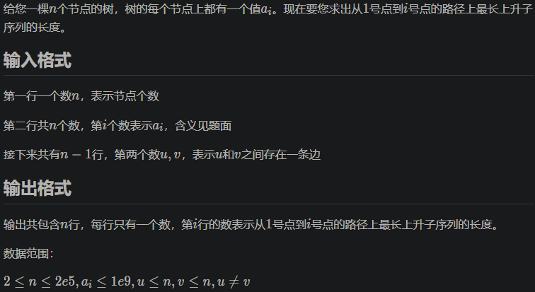

對於樹上每一條路徑，用優化後的 LIS 算法 $O(n\log{n})$ 地求出 LIS，並在遞歸中繼承和回溯。

難點在於回溯操作，可以提前記錄修改操作，並在子樹處理之後撤銷。

## 樹上二分

**例題：洛谷 P3000 Cow Calisthenics G**

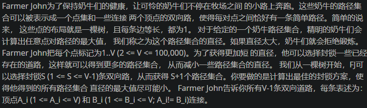

首先要求求最大值的最小值，應爲二分答案。

我們從下往上遍歷，如果添加一條邊之後最長路徑超過了二分的答案，貪心地要求保留邊長最小的邊，那麼就應當刪去子樹的根與最長路徑之間的連邊，這樣保留的邊一定最小，不具有後效性。

## 綜合

**例題：洛谷 P6869 Putovanje**

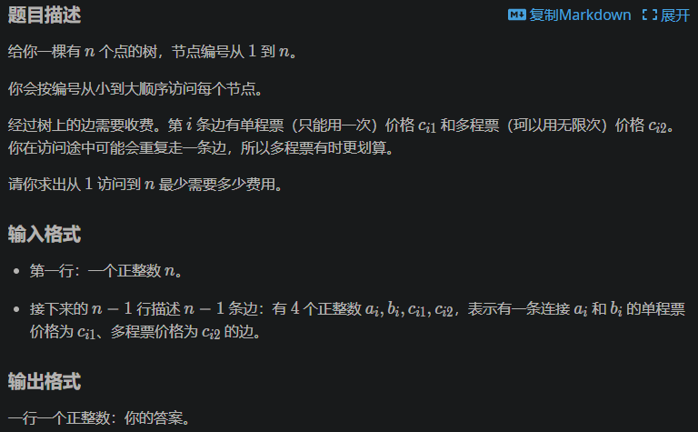

由於題目要求按順序走完所有節點，因此兩兩之間的最優路徑是唯一的，否則至少不能省去代價。對於一對起點和終點，最短就是到 LCA 的距離，將路徑經過的所有邊標記。但是這樣可能超時（尤其是在 YZZX 孱弱的評測機上），因此要使用樹上差分優化，最後一次性計算。

## 下課！

您達成了新的成就——每題都有分！
