~~狀態是，啊？離離離離——喲喲——~~

對應洛谷題號：

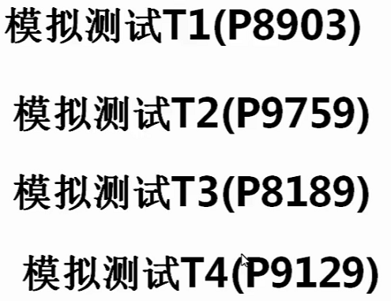

## 單調隊列優化

### 線性 DP

**例題：PTA-Little Bird（洛谷 P3572）**

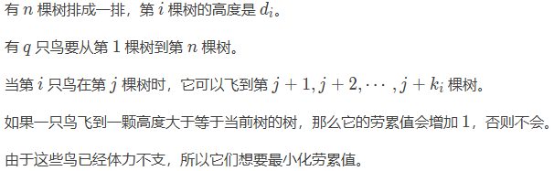

設一隻鳥在第 $i$ 棵樹的疲勞值是 $f_{i}$，則 $f[i] = \min{f_{j} + h_{i} \geq h_{j}}$，其中 $i - k \leq j \lt i$。當 $i$ 增加時，可以發現求最小值的部分是有重合的，因此我們可以通過去除冗餘部分來優化。

上述公式中 $[i - k,i)$ 的部分類似於一個滑動窗口，我們每次刪除不在區間內的部分，並加入新的區間內的元素，通過（遞增）單調隊列的數據結構來維護最小值。

- 如果隊頭的元素（最小值）在範圍內，我們直接採用；
- 如果隊頭的元素不在範圍內，我們將其刪除；
- 新的元素從隊尾加入，如果比隊尾更優，則一直將隊尾出隊（因爲新的元素在時效上更優，舊元素沒有作用了），直到前方元素比新元素更優。

代碼：

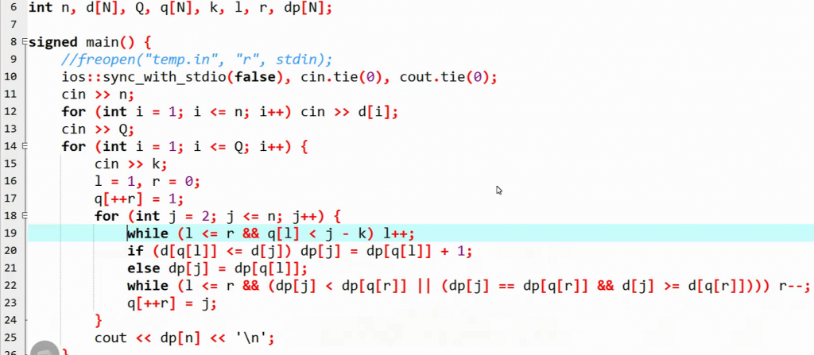

要點：

- 第 19 行執行了出隊操作；
- 第 22 行對於隊尾貢獻一定不及新元素的元素進行了出隊，對於貢獻相同的元素，依然進行了出隊，因爲新元素時效性更強。

### 多重揹包

**例題：BAN-Bank Notes（洛谷 P3423）**

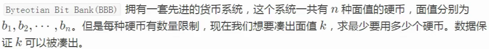

對題意進行分析，發現：

- 揹包容量是面值 $k$；
- 物品體積是每種硬幣的面值；
- 物品價值並不是面值，而是每個物品都爲 $1$，且要求總價值最小。

設 DP 狀態 $f_{i,j}$ 表示第 $i$ 個硬幣、總面值爲 $j$，則有轉移方程 $f_{i}{j} = \max{f_{i - 1,j - k \times w_{i}} + k \times v_{i}}$ ，其中 $v_{i}$ 在本題中爲 $1$，時間複雜度爲 $O(j * \Sigma c_{i})$。

**倍增優化**：這個轉移方程的時間複雜度瓶頸在於對於每種面值的硬幣選取多少個的枚舉，因此我們可以將其轉換爲倍增的 01 揹包，也就是將可以取無限個的物品轉化爲 $w_{i}, v_{i}$，$2 \times w_{i}, 2 \times v_{i}$，$4 \times w_{i}, 4 \times v_{i}$ 等等的單個物品。對於具有連續枚舉的 DP，倍增優化是一種常見的方法。

**單調隊列優化**：考慮 $j$ 時的決策，有貢獻的可能是 $j - b_{i}$，$j - 2 \times b[i]$，$j - 3 \times b_{i}$ 等；$j + b_{i}$ 時，則爲 $j$，$j - 1 \times b_{i}$，$j - 2 \times b_{i}$。因此可以發現，這裏又出現了重複貢獻的計算，因此我們依然可以使用單調隊列進行優化。

出現新的元素時，我們在加入隊列之前需要將隊列中所有的元素都添加 $v_{i}$，時間複雜度較高。但是可以發現，反過來我們可以給新加入的元素對應的值減去 $v_{i}$，然後加入單調隊列，時間複雜度大大降低。其中可以體現「正難則反」的思想。

代碼：

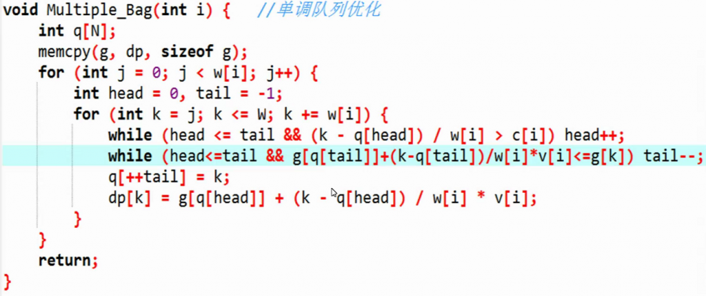

## 網格圖上的 DP

原始題型：

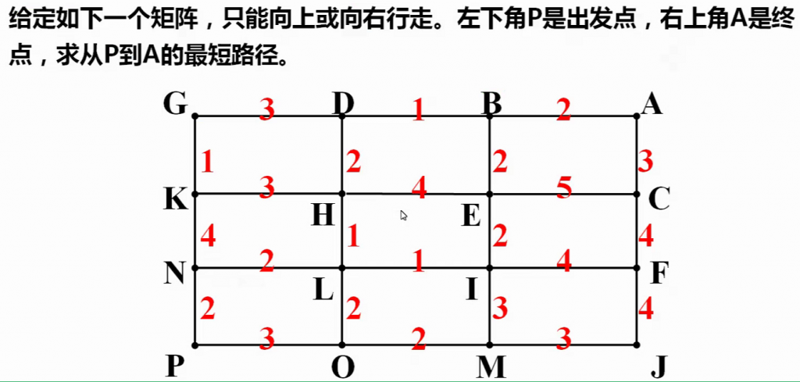

**例題：方格取數（洛谷 P7074）**

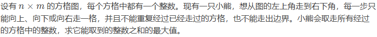

本題的特殊之處在於，通常而言網格圖問題只能向右或向下，但是本題可以多了向上的方向，因此上下的 DP 狀態按照原來的方法就相互依賴，不可行。

因此這裏我們需要改進我們的狀態設計。原本的二維 DP 之外，我們額外添加一個表示方向的維度，即 $f_{x,y,d}$，其中 $d \in \{0, 1, 2\}$，表示當前格子從下、左或上方到達當前格子的最大結果。因此可以先對第一列填充（只能向下），然後填充剩餘部分的右、下方向，最後從下往上填充上方的值。

對應的轉移方程爲：

- $f_{i,1,1} = f_{i - 1,1,1} + a_{i,1}$
- 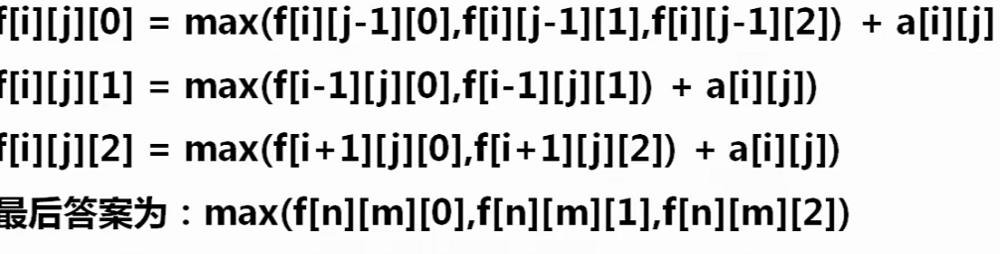

**例題：Palindromic Paths（洛谷 P3126）**

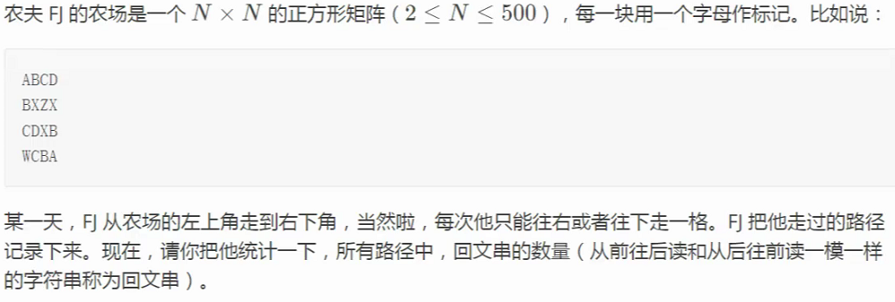

迴文串就要求路徑上的字母是對稱的，因此我們可以枚舉步數和兩個對應的座標，這 5 個值中有 1 個可以由其他 4 個推出，因此設計狀態爲 $f_{x_{1},y_{1},x_{2},y_{2}}$ 或 $f_{step,x_{1},y_{1},x_{2}}$。再次考慮，可以發現其實只需要橫座標就可以推出當前位置，並且步數的維度可以用滾動數組壓縮，因此規避了數組過大無法開出的問題。

代碼：

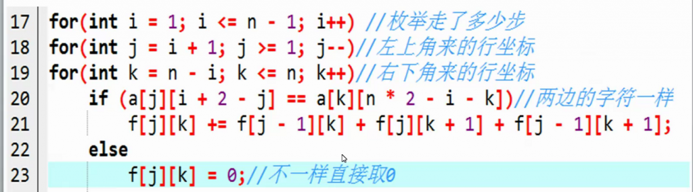

## 狀態壓縮 DP

**例題：PRZ（洛谷 P5911）**

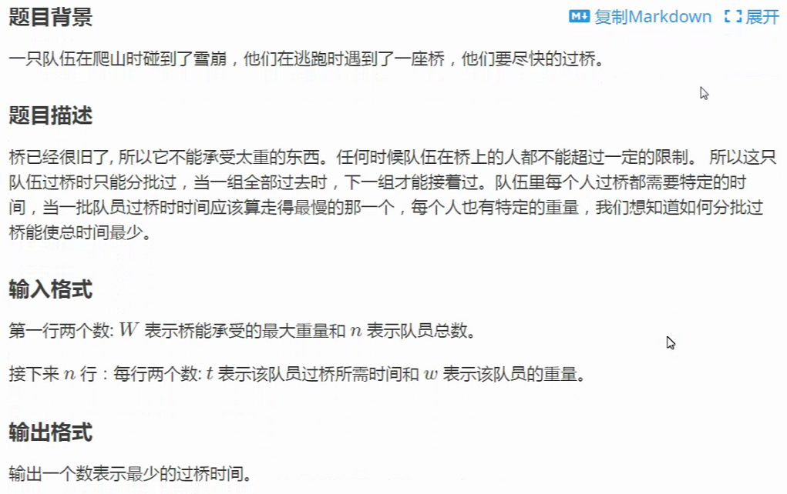

對於狀態維度很多、但是每個維度的信息很少的 DP，可以使用一個二進制數表示當前狀態。在本題中，設 $f_{s}$ 中 $s$ 表示當前哪些人已經過橋，例如 `10001` 表示第一個和第五個人已經過橋，其他人則沒有。

代碼：

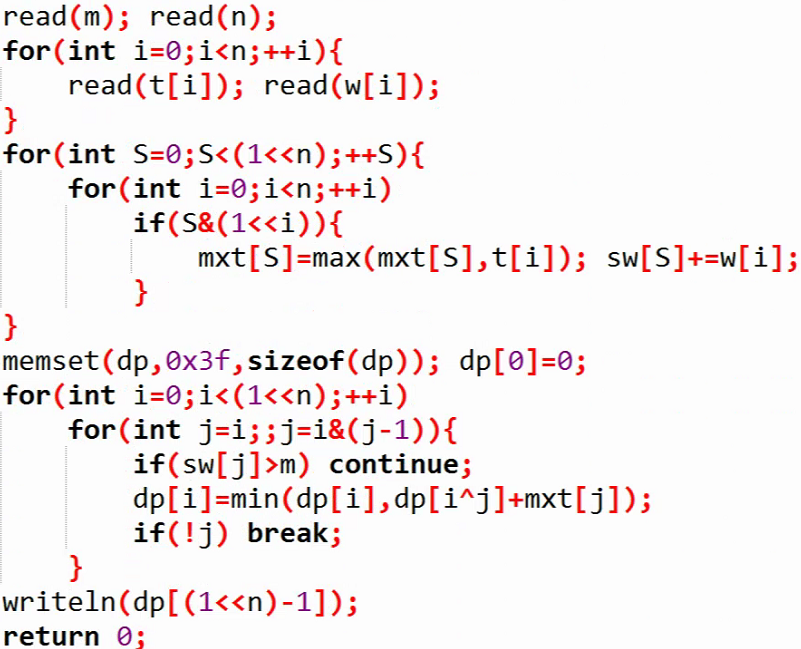

其中狀態枚舉的部分，先枚舉每個情況，再對於每個情況從它的子集遞推。

**例題：Corn Fields（洛谷 P1879）**

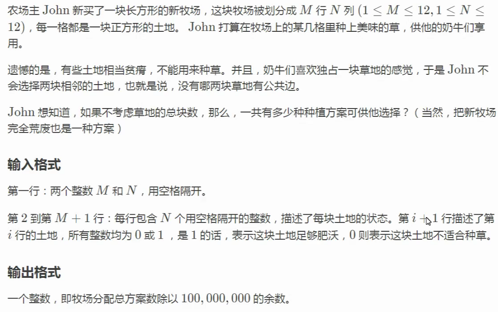

本題在狀壓 DP 的基礎上，需要添加一維，作爲公共邊的表示。

## 數位 DP

**例題：數字計數（洛谷 P2602）**

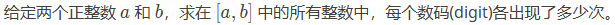

首先對於題意進行轉換，由於左右區間的計算比較困難，可以將其轉化爲 $[1, b]$ 中的計數，減去 $[1, a]$ 之間的計數。

在數位 DP 中，一般會由高位到低位進行處理。

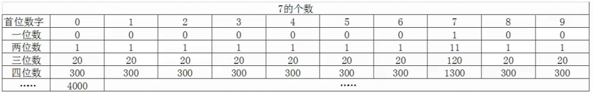

設 $f_{i,j}$ 表示 $i$ 位所有以 $j$ 開頭的所有數字中，含數字 $7$ 的個數，那麼有狀態轉移方程：

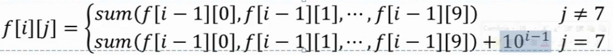

其中第二個表達式的 $10^{i - 1}$ 表示 $7$ 開頭的數字，所有的都應當被計入。例如：

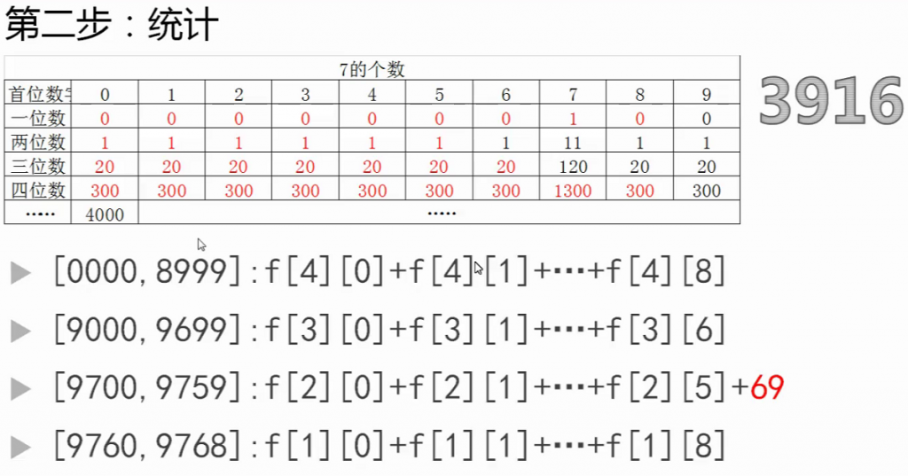

其中的 $69$ 表示，所有 $97$ 開頭的數字都含有 $7$，也就是第三位的貢獻。

數位 DP 的套路包括：

- 按位生成 $f$ 表達式；
- 按位計算存在的情況，並在高位出現情況時添加貢獻。

代碼：

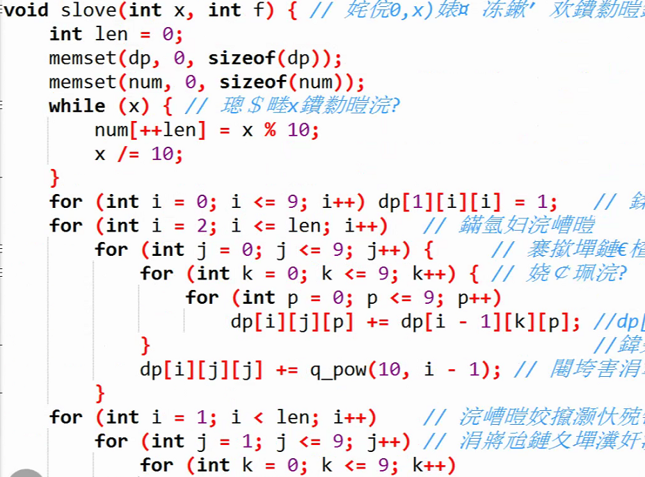

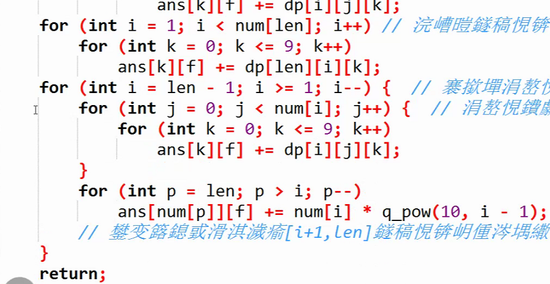

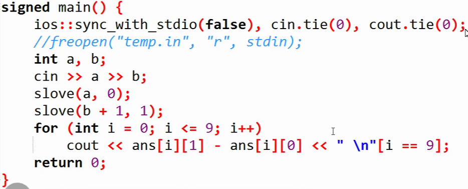

用遞推實現數位 DP，情況的分類比較多，因此實現比較麻煩。遞歸的方法，需要解決的情況就少了很多，寫法很簡單。

代碼：

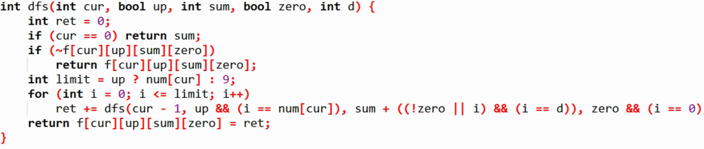

中間有一行截斷了，後面是 `, d`。

其中參數的含義分別爲：

- `cur`：當前是第幾位；
- `up`：當前位之前的數字是否已經到達最大，也就是說這一位是否可以到 9，還是隻能到右邊界的對應值；
- `sum`：目前已知的情況的總和；
- `zero`：是否有前導零；
- `d`：總數位。

## 題目講解

### Bribing Friends（洛谷 P8903）

本題中錢數是揹包的總容量，每個朋友所需的錢和甜筒是每個物品的體積，而受歡迎程度則是物品的價值。

考慮第 $i$ 個朋友，使用 $x$ 元錢和 $y$ 個甜筒所能獲得的最大價值，即 $f_{i,x,y}$。由此很容易推出 DP 狀態轉移方程，時間複雜度 $O(n^3)$。

將所有朋友按每元錢所需甜筒排序，對於較大的，應當儘量使用錢；較小的，應當儘量使用甜筒。這樣可以從兩個方向進行遞推，然後得出最終結果。

代碼：

```
#include <bits/stdc++.h>
#define int long long
#define N 2010
using namespace std;

int n, a, b;
int f[N][N], g[N][N];
struct node { int p, c, x; } cow[N];
bool cmp(node x, node y) { return x.x < y.x; }

signed main() {
    freopen("friends.in", "r", stdin);
    freopen("friends.out", "w", stdout);
    ios::sync_with_stdio(false), cin.tie(0), cout.tie(0);
    cin >> n >> a >> b;
    for (int i = 1; i <= n; i++) 
        cin >> cow[i].p >> cow[i].c >> cow[i].x;
    sort(cow + 1, cow + n + 1, cmp);
    for (int i = 1; i <= n; i++) {
        for (int j = 0; j <= b; j++) f[i][j] = f[i - 1][j];
        for (int j = 0; j + cow[i].x * cow[i].c <= b; j++) 
            f[i][j + cow[i].x * cow[i].c] = max(f[i - 1][j + cow[i].x * cow[i].c], f[i - 1][j] + cow[i].p); 
    }
    for (int i = n; i >= 1; i--) {
        for (int j = 0; j <= a; j++) g[i][j] = g[i + 1][j];
        for (int j = 0; j + cow[i].c <= a; j++) 
            g[i][j + cow[i].c] = max(g[i + 1][j + cow[i].c], g[i + 1][j] + cow[i].p);
    }
    int ans = 0;
    for (int i = 1; i <= n; i++) {
        ans = max(ans, f[i][b] + g[i + 1][a]);
        ans = max(ans, f[i - 1][b] + g[i][a]);
        for (int j = 0; j <= min(a, cow[i].c); j++) {
            if (cow[i].x * (cow[i].c - j) > b) continue;
            ans = max(ans, f[i - 1][b - cow[i].x * (cow[i].c - j)] + g[i + 1][a - j] + cow[i].p);
        }
    }
    cout << ans << '\n';
    return 0;
}
```

### Bomboni（洛谷 P9759）

這個部分沒有太聽懂……

代碼：

```
#include <bits/stdc++.h>
#define ll long long
#define N 510
#define mod 998244353
using namespace std;

int n, K;
int a[N][N];
int cnt = 0, fac[N], num[1000010];
int f[N][N][N];

void init(int n, int k) {
    for (int i = 1; i <= k; i++) {
        if (k % i == 0) {
            fac[++cnt] = i;
            num[i] = cnt;
        }
    }
    fac[++cnt] = k;
    num[k] = cnt;
}

ll gcd(ll x, ll y) { return __gcd(x, y); }

int main() {
    freopen("candy.in", "r", stdin);
    freopen("candy.out", "w", stdout);
    ios::sync_with_stdio(false), cin.tie(0), cout.tie(0);
    cin >> n >> K;
    memset(a, -1, sizeof a);
    for (int i = 1; i <= n; i++)
        for (int j = 1; j <= n; j++) {
            cin >> a[i][j];
            if (a[i][j] != -1) a[i][j] = gcd(a[i][j], K);
        }
    init(n, K);
    f[1][1][num[gcd(a[1][1], K)]] = 1;
    for (int i = 1; i <= n; i++) {
        for (int j = 1; j <= n; j++) {
            if (a[i][j] == -1) continue;
            for (int k = 1; k <= cnt; k++) {
                if (!f[i][j][k]) continue;
                if (a[i + 1][j] != -1 && i < n) {
                    int x = gcd(K, 1ll * fac[k] * a[i + 1][j]);
                    f[i + 1][j][num[x]] = (f[i + 1][j][num[x]] + f[i][j][k]);
                    if (f[i + 1][j][num[x]] >= mod) f[i + 1][j][num[x]] -= mod;
                }
                if (a[i][j + 1] != -1 && j < n) {
                    int x = gcd(K, 1ll * fac[k] * a[i][j + 1]);
                    f[i][j + 1][num[x]] = (f[i][j + 1][num[x]] + f[i][j][k]);
                    if (f[i][j + 1][num[x]] >= mod) f[i][j + 1][num[x]] -= mod;
                }
            }
        }
    }
    cout << f[n][n][cnt] << '\n'; 
    return 0;
}
```

### Redistributing Gifts（洛谷 P8189）

代碼：

```
//鐘跺帇DP 
#include <bits/stdc++.h>
using namespace std;
namespace IO{
	template <typename T> inline void write(T x) {
	    if(x < 0)
	        putchar('-') , x = - x;
	    if(x == 0) {
	        putchar('0') ;
	        return ;
	    }
	    if(x > 9) write(x / 10);
	    putchar(x % 10 + '0');  //瀛楃杈撳嚭 
	    return ;
	}
	template <typename T> inline void read(T &x) {
	    x = 0; int w = 1; char ch = getchar();
	    while (!isdigit(ch)) { if (ch == '-') w = -1; ch = getchar(); }
	    while (isdigit(ch)) x = (x << 1) + (x << 3) + (ch ^ 48) , ch = getchar();
	    x *= w;
	    return ;
	}
}
#define writeln(x) write(x) , putchar('\n')
#define writesp(x) write(x) , putchar(' ')
using namespace IO;
#define For(i, j, k) for(int i = (j); i <= (k); ++i)
#define Dec(i, j, k) for(int i = (j); i >= (k); --i)
#define mp make_pair
#define pii pair<int, int> 
#define ppi pair<pii, int>
#define ckmax(a, b) ((a) = max((a), (b)))
#define ckmin(a, b) ((a) = min((a), (b)))
#define pb emplace_back   //姣攑ush_back蹇偣錛屽姛鑳戒竴鏍鳳紝搴曞眰瀹炵幇紼嶆湁鍖哄埆 
#define inf 0x3f3f3f3f
#define fi first
#define se second
#define N 20
#define ll long long

ll dp[1 << N][N];
ll ans[1 << N];
char op[N];
int n, x, g[N];
int main() {
	freopen("gifts.in", "r", stdin);
    freopen("gifts.out", "w", stdout);
	read(n);
	For(i, 0, n - 1) { //奼倈[i] 
		bool flag = true;
		For(j, 0, n - 1) {
			read(x); --x;
			if (!flag) continue;
			g[i] ^= (1 << x);// 瀛樺偍鎵€鏈夊ザ鐗沬鑳芥敹鍒扮殑紺肩墿x
			if (x == i) flag = false;	
		}
	}
	ans[0] = 1;
	for (int k = 0; k < n; ++k) dp[1<<k][k] = 1;
	For(i, 0, n - 1) {
		For(mask, 1 << i, (1 << (i + 1)) - 1) {
			For(last, 0, i)  {
				if (!(mask & (1 << last))) // 榪囨護涓嶅湪褰撳墠闆嗗悎鐨勫ザ鐗?
					continue;
				ll val = dp[mask][last];
				For(k, 0, i - 1)  
					if (!(mask & (1 << k)) && (g[last] & (1 << k))) // 涓嶅湪mask涓笖濂剁墰last鍙互鏀跺埌鐨勭ぜ鐗﹌錛岃繘琛岀姸鎬佽漿縐?
						dp[mask^(1<<k)][k] += val;
				if (g[last] & (1 << i)) // 濡傛灉濂剁墰last鍙互鏀跺埌紺肩墿i錛屽墶mask闂幆浜嗐€傚嵆紺肩墿闆唌ask鍜屽ザ鐗溳泦mask閮藉緱鍒頒簡鍖歸厤
					ans[mask] += val;	
			}
			For(k, i + 1, n - 1)  // 璁＄畻瀹宎ns[mask] 鏇存柊楂樹綅mask鐨刣p 
				dp[mask^(1<<k)][k] += ans[mask];
		}
	}
	int q; read(q);
	while (q--) {
		cin >> op;
		int H = 0, G = 0;
		For(i, 0, n - 1)  
			if (op[i] == 'H') H ^= (1 << i);
			else G ^= (1 << i);	
		writeln(ans[H] * ans[G]);
	}
	return 0;
}
```

### Piling Papers（洛谷 P9129）

```
#include <bits/stdc++.h>
using namespace std;
#define ll long long
#define N 310
#define Q 50010
const int mod = 1e9 + 7;

int n, q;
ll A, B;
int a[N], ans[Q], C[N][N], pow2[N];
int f[N][20][20], g[N][20][20][20];

struct node { int l, r, id; }que[Q];
bool cmp(node a, node b) {
    if (a.l != b.l) return a.l < b.l;
    return a.r < b.r;
}

void solve(ll x, int fh) {
    int p = 1;
    int num[20], cnt = 0; 
    while (x) {
        num[++cnt] = x % 10;
        x /= 10;
    }
    reverse(num + 1, num + cnt + 1);
    for (int lft = 1; lft <= n; lft++) { // 緇熻浠?lft 寮€濮嬪悜鍙抽€夌墝鐨勬柟妗堟暟
        memset(f, 0, sizeof(f));
        memset(g, 0, sizeof(g));
        for (int rgt = lft; rgt <= n; rgt++) {
            for (int len = 1; len <= cnt; len++) {
                for (int i = 1; i + len - 1 <= cnt; i++) {
                    int j = i + len - 1;//f[rgt][i][j]琛ㄧず鍙栧埌a[rgt](鍙笉鍙栵級錛屾嫾鎴?x[i]鈥斺€攛[j]鐨勬柟妗堟暟錛堣繖閲寈瑙嗕負涓€涓瓧絎︽暟緇勶級銆?
                    (f[rgt][i][j] += f[rgt - 1][i][j]) %= mod;//榪欐槸涓€涓尯闂村姩鎬佽鍒掞紝鍖洪棿[i,j]鍙敱[i+1,j]鍜孾i,j-1]杞Щ鑰屾潵銆?
                    if (len == 1) { // i == j
                        if (a[rgt] == num[i])  (f[rgt][i][j] += 2) %= mod;// 1 or 2 method 
                    }
                    else { 
                        if (a[rgt] == num[i]) (f[rgt][i][j] += f[rgt - 1][i + 1][j]) %= mod; // 鍔犲墠闈?( 1 method )
                        if (a[rgt] == num[j]) (f[rgt][i][j] += f[rgt - 1][i][j - 1]) %= mod; // 鍔犲悗闈?( 2 method ) 
                    }
                }
            }
        }
        for (int rgt = lft; rgt <= n; rgt++) {
            for (int len = 1; len <= cnt; len++) {
                for (int i = 1; i + len - 1 <= cnt; i++) {
                    int j = i + len - 1;// 褰撴嫾鍑虹k浣嶅皬浜巟[k]鐨勬暟錛屼笖絎琸浣嶄箣鍓嶄笌x涓€鑷寸殑鏁版椂錛宬涔嬪悗鐨勬暟鍙互浠誨彇銆?
                    for (int k = i; k <= j; k++) { //浠[rgt][i][k][j]琛ㄧず鍙栧埌a[rgt]錛屾嫾鍑簒[i]鍒皒[k-1]錛岀k浣嶅皬浜巟[k]涓旂k + 1鍒癹浣嶄換鎰忓彇鐨勬柟妗堟暟銆?
                        (g[rgt][i][k][j] += g[rgt - 1][i][k][j]) %= mod;
                        if (i == k) {// 鍔犲墠闈?(1 method, a[rgt]鏀懼湪i)
                            if (a[rgt] < num[i]) { // 鍖洪棿[k+1,j]鐨勬暟浠巃鐨刐lft, rgt-1]鍖洪棿閲屼換鎰忛€夋嫨涓€涓粍鍚?
                                int tmp = (ll)C[rgt - lft][j - k] * pow2[j - k] % mod;
                                (g[rgt][i][k][j] += tmp) %= mod;
                            }
                        }
                        else {
                            if (a[rgt] == num[i]) 
                                (g[rgt][i][k][j] += g[rgt - 1][i + 1][k][j]) %= mod;
                        }
                        if (k == j) {// 鍔犲悗闈?2 method, a[rgt]鏀懼湪j
                            if (a[rgt] < num[j]) {// all-same way + [a_t as small]
                                int tmp = i == j ? 1 : f[rgt - 1][i][j - 1];
                                (g[rgt][i][k][j] += tmp) %= mod;
                            }
                        }
                        else { 
                            (g[rgt][i][k][j] += g[rgt - 1][i][k][j - 1]) %= mod;
                        }
                    }
                }
            }
        }  
        while (que[p].l == lft && p <= q) { // 灝嗘墍鏈夎闂綰匡紝鎸夌収宸︾鐐規帓搴忋€傚悓涓€宸︾鐐圭殑璇㈤棶鍙渶鍋氬悓涓€嬈?dp銆?
            int i = que[p].r - que[p].l + 1;
            for (int j = 0; j <= cnt - 1; j++) {// 鐭殑
                ll tmp = fh * C[i][j] % mod * pow2[j] % mod;
                tmp = (tmp + mod) % mod;
                (ans[que[p].id] += tmp) %= mod;
            }
            for (int k = 1; k <= cnt; k++) { // 絳夐暱鐨勶紝灝忎簬x鐨?
                ll tmp = fh * g[que[p].r][1][k][cnt] % mod;
                tmp = (tmp + mod) % mod;
                (ans[que[p].id] += tmp) %= mod;
            }
            ll tmp = fh * f[que[p].r][1][cnt] % mod; // 絳夐暱鐨勶紝絳変簬x鐨?
            tmp = (tmp + mod) % mod;
            (ans[que[p].id] += tmp) %= mod;
            ++p;
        }
    }
}

signed main() {
    freopen("sequence.in", "r", stdin);
    freopen("sequence.out", "w", stdout);
    ios::sync_with_stdio(false), cin.tie(0), cout.tie(0);
    cin >> n >> A >> B;
    for (int i = 1; i <= n; i++) cin >> a[i];
    cin >> q;
    for (int i = 1; i <= q; i++) {
        cin >> que[i].l >> que[i].r;
        que[i].id = i;
    }
    sort(que + 1, que + q + 1, cmp);
    pow2[0] = 1;
    for (int i = 1; i <= n; i++) pow2[i] = pow2[i - 1] * 2 % mod;
    for (int i = 0; i <= n; i++) {
        for (int j = 0; j <= i; j++) {
            if (j == 0 || j == i || i == 0) {
                C[i][j] = 1;
                continue;
            }
            C[i][j] = (C[i - 1][j - 1] + C[i - 1][j]) % mod;
        }
    }
    solve(B, 1);
    if (A > 1) solve(A - 1, -1);
    for (int i = 1; i <= q; i++) cout << ans[i] << '\n';
    return 0;
}
```
