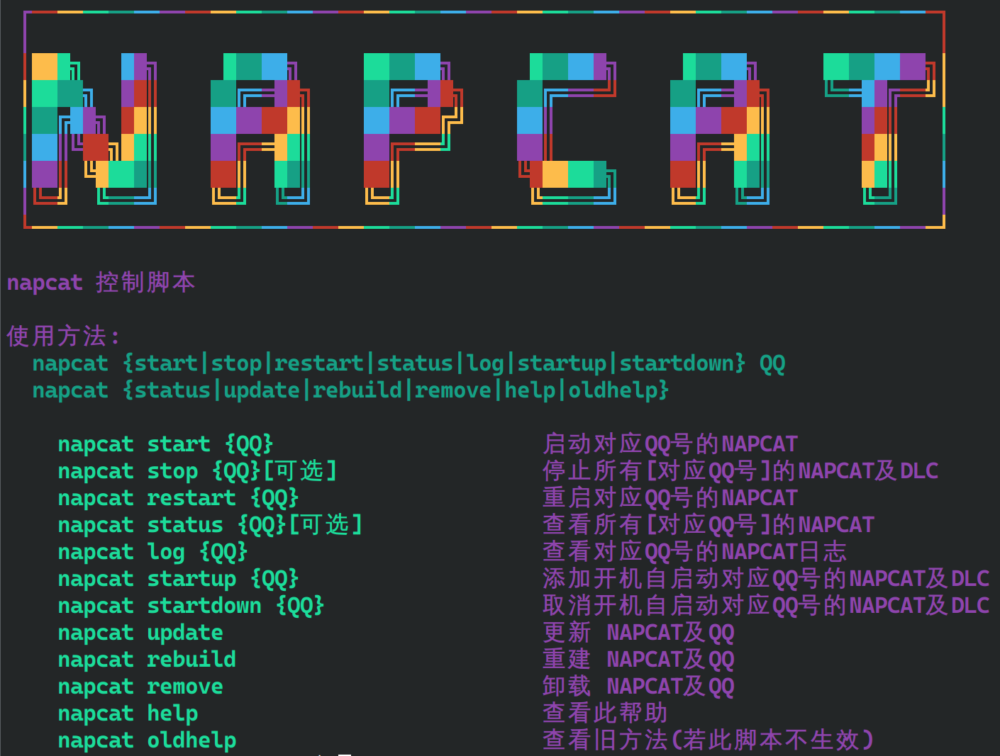

您想给 QQ 上那些天天目空一切的群友们见见世面吗？您想被他们称一声「感谢大佬」吗？——您想 QQ 被封号吗？您想被刷爆 token 吗？

本蛾子今天就跟您一起当个大冤种，搭建一个 QQ 机器人吧！

## 🤔 明确思路

QQ 像 Telegram 一样，是有官方机器人平台的。和 Telegram 不一样的是，创建机器人需要实名认证，而且不能加入 20 人以上的群，服务器还需要设置 IP 白名单（当然除非您花钱拿企业认证）。

因此，我国勤奋刻苦的劳动人民就开发了另一种有效绕过以上限制的方法——当人机。不是，本蛾子是指，假装您正在使用 QQ 客户端登录，然后操作它发送消息，这叫「消息平台」，这则博客中选择 [NapCat](https://github.com/NapNeko/NapCatQQ) 作为消息平台。

> 😮 其实由于 OneBot 的 API 规范标准，大部分比较新的消息平台都可以与马上要说的机器人平台无缝对接。选择 NapCat 是因为它开发积极，~~且有花里胡哨的 CSS~~。

> 用某特定行业的话来说，这实际上是客户端的「2API」。

然后您便可以自动化接受和发送的过程。由于我们不使用官方平台，那些花里胡哨的点击交互是用不了了，但是基础的问答、文件读取等还是可以的。今天我们要做的是将 LLM 融入 QQ，因此我们选择 [AstrBot](https://github.com/Soulter/AstrBot) 作为自动化平台。

> 😁 主要是因为配置简单，而且开发积极得吓人：本蛾子写这则博客的时候，前 24 小时内发布了 3 个 release，每个功能和修复都超过 10 条。

最后，最关键的是您使用的 LLM 需要支持 API，最好还得免费，不然被群友刷爆的时候拿着账单就欲哭无泪了。本蛾子搜了一圈，似乎只有 Cloudflare AI Workers 和 Google Gemini 支持免费调用（其实还有个 xAI Grok，但是最近在削减限额）。

Cloudflare AI Workers 的问题是只有开源大语言模型，因此先进的模型中只有蒸馏后的 Deepseek 可用——关键还不完全免费。只有 Google Gemini 只限速率不限数量。

## ⚙️ 搭建 Gemini 代理

当然，一个事实就能让以上 CoT 瞬间失效：Gemini API 在国内并不可用。

好在解决方法也够简单，直接在你的海外服务器上搭建一个反向代理即可。如果您使用 NGiNX，您可以直接参考本蛾子的配置：

```nginx
server {
    listen 443 ssl;
    listen [::]:443 ssl;
    server_name sld.yourdomain.tld;
    ssl_certificate /path/to/public.crt;
    ssl_certificate_key /path/to/private.key;
    location / {
        proxy_pass  https://generativelanguage.googleapis.com/;
        proxy_ssl_server_name on;
        proxy_set_header Host generativelanguage.googleapis.com;
        proxy_set_header Connection '';
        proxy_buffering off;
        proxy_cache off;
        proxy_set_header X-Forwarded-For $remote_addr;
        proxy_set_header X-Forwarded-Proto $scheme;
    }
}
```

就是最简单的代理。Google 为了用户着想，没跟 OpenAI 学坏，什么降智、封禁、语言歧视一概不存在，换个 header 直接远程请求 ✌️

如果您是 Cloudflare 的忠实白嫖用户，这个简单的功能拿 Workers 大概很好实现，本蛾子简单搜了搜，很多现成的代码可以用。至于服务端的代理，如果不需要 New API 那种管理面板，建议直接用反向代理，不要用人家写的项目。

## 🐧 NapCat 安装

为了能接受图片、语音，建议您使用原生的安装脚本而不是 Docker 镜像，后者在功能上有诸多问题。另外，建议您在国内服务器（没有公网 IP 也成，家里直接拿个树莓派其实更好）搭建 NapCat，毕竟有海外登录记录的 QQ 号是见光死的。

首先直接用一键脚本安装（支持 RPM 和 DEB 系，AUR 有打包）：

```bash
curl -o napcat.sh https://nclatest.znin.net/NapNeko/NapCat-Installer/main/script/install.sh && sudo bash napcat.sh
```

这个脚本充分考虑了国内用户的需求，凡是需要 GitHub 下载的都自动选择了镜像。

慢慢等待安装完成，问你话了就敲个 `y` 敷衍一下，很快就能安装完成。之后管理 NapCat，直接使用 `sudo napcat <command>` 就行。例如，您可以用 `sudo napcat help` 查看说明：



NapCat 的管理面板默认在 `http://<IP>:6099/webui` 上，登录 token 可以在 `/opt/QQ/resources/app/app_launcher/napcat/config/webui.json` 找到。注意如果您没有添加任何 QQ 号，服务似乎不会启动，您可以准备好 QQ 号（单独注册一个）然后写 `sudo napcat start {QQ}` 启动一下，就能看到 UI 面板了。

> 😮‍💨 本蛾子还没写完怎么操作 NapCat 呢，QQ 号就给封了。不过原因是「违规注册账号」，查了一下大概意思就是大量注册小号，发广告什么的，大概是因为这个号第一天就加入了一些群聊，好友却只有一个（本蛾子），被风控了。
>
> 等本蛾子回去解封一下，再接着写这一段吧。

当然这里演示的是最简单的操作，开头就说过，NapCat 本质上是一个「2API」产品，它将 QQ 的功能转化为可以以 WebSocket 和 HTTP 调用的 API，可玩性很高。加之 QQ 最近换用了 Electron 的新客户端，使得注入技术变得很容易。大家也可以看看（CSS 也很花里胡哨的）[文档](https://napneko.github.io/)，自己玩玩。

> 🤣 作者甚至给 NapCat 编了个拟人化小故事……

## 🤖 安装 AstrBot

由于 AstrBot 的依赖比较复杂，我们采用 Docker 方法安装。

由于国内 Docker 环境比较复杂，本蛾子这里就采用 Podman（在大部分发行版官方源里就有打包）安装，然后[通过镜像](https://wcbing.top/linux/containers/install/)拉取。

```bash
mkdir astrbot
cd astrbot
mkdir data
sudo docker run -itd -p 6180-6200:6180-6200 -p 11451:11451 -v $PWD/data:/AstrBot/data --name astrbot soulter/astrbot:latest
```

> 💩 这开发者不玩花里胡哨的 CSS 了，开始臭起来了：这什么端口号啊。

啊对了，刚刚忘记说了，要开放防火墙。

然后，您大概就可以在 `http://<IP>:6185` 看到 AstrBot 的管理面板了，默认用户名和密码都是 `astrbot`。

> 因为 QQ 封号，本蛾子不太好给您演示如何创建接口，也等等吧……

切换到「配置」「服务提供商」，这里面的设置只要您稍微了解一些 LLM API 的知识，应该都是很好填写的，至于 TTS 和 STT 功能，本蛾子也没弄明白，而且似乎所有提供商都是收费的。但是，由于 Gemini 的输入支持图片，图片转述功能是有效的；虽然 Gemini 不能联网搜索，但是「大语言模型设置」里 AstrBot 可以帮您搜索并把结果添加进提示词里，也就可以间接实现搜索了。

最后，记得到「其他配置」「管理员 ID」里设置一下您的 QQ 号，方便管理鉴权。

## ✈️ 发送！

然后来到您的 QQ（希望您已经跟您的机器人加上好友了），发送 `/help` 先测试一下有没有连通。

如果没问题，再用您定义的提示词发送一个问题，稍等一会儿（可能在 10 秒左右）应该就能看到回复了！但是有一个问题，由于 TCP 连接是有时间限制的，而如果您开了 Cloudflare 代理，服务端大预言模型生成时长超过了，就会被强制截断，导致出错。本蛾子目前没找到解决方法，只能关掉小黄云。

记得前几天先不要把机器人拉进群聊，有很大概率会被当作广告（而非机器人）账号封禁。另外，千万要设置「不允许群聊私聊」还有「不允许加好友」，否则一分钟几十条消息，这特征搞得 QQ 轻松封禁。
