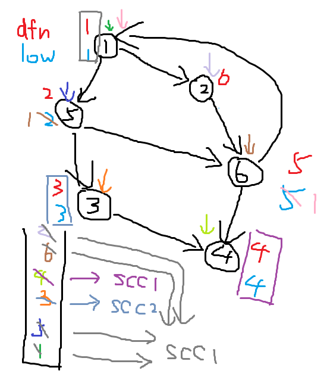

**圖的連通性問題**主要包括：

- 割邊和割點；
- 強連通分量和縮點；
- 邊雙連通分量和點雙連通分量。

求解這些問題，效率最高、思路最清晰的算法是 **Tarjan** 算法，由**羅伯特·恩卓·塔揚**發明。塔揚研究了並查集、圖論等許多領域，因此有很多以他名字命名的算法，這裏是指關於圖的連通性問題的算法。

## 割邊和割點

不大嚴謹、完全不形式化的定義：

- **割邊**：如果刪除圖上的某條邊，圖就不再連通，那麼這條邊就是圖的割邊。
- **割點**：如果刪除圖上的某個點以及與其相連的所有邊，圖就不再連通，那麼這個點就是圖的割點。

暴力求解這個問題，可以枚舉刪除某一條邊或者某一個點，然後通過 DFS 判斷連通性，平均時間複雜度是 $O(n^2)$。

首先需要了解的是 **DFS 樹**。DFS 樹是從圖上任意一點開始 DFS，由 DFS 順序所構成的一棵樹，開始點對於答案沒有影響。在樹上出現的邊稱爲**樹邊**，否則稱爲**非樹邊**。

在割邊和割點問題中，一般只研究無向圖。非樹邊在 DFS 樹中以**返祖邊**的形式出現，其含義就是字面含義。

### 割點

割點可以分爲兩種情況：

- 根節點在 DFS 樹中有多餘一個子節點，那麼它就是割點；
- 對於一個非根節點，它的子樹中至少有一棵，不存在一條返祖邊可以回到它的祖先節點。

第一種請款很簡單；第二種情況，如果子樹上存在到它的祖先的返祖邊，當它被刪除之後，這棵子樹仍然可以通過返祖邊到達原本節點的祖先。

求割點的方法：

- $dfn_{i}$ 表示節點 $i$ 的時間戳，或者也可以說是節點在 DFS 樹中的深度，通過其大小比較可以判斷祖先與子孫的關係；
- $low_{i}$ 表示節點 $i$ 不經過其父節點能到達的 $dfn$ 最小的祖先。（這個概念大部分博客都沒有講清楚，本蛾子搜遍互聯網終於找到了對其的明確定義，特此感謝：[Tarjan 算法求解無向圖的割點與割邊](https://skywt.cn/blog/tarjan-cut-vertex-cut-edge/)，可惜的是這篇博客下面的代碼是錯誤的。）

對於一個節點 $v$ 及其祖先 $u$，如果回溯時發現 $low_{v} \geq dfn_{u}$，也就是說 $v$ 回不到 $u$ 的祖先（取等，因爲此時與 $3$ 相連的所有邊都被刪除，所以不可能到達）。

還需要注意，當一個節點的子節點已經被訪問，更新應當使用 `dfn[e[i].t]` 而非 `low[e[i].t]`。若使用後者，會導致割點的子節點使用割點能訪問的祖先節點更新，那這就白跑了。

代碼實現（可以根據註釋理解）：

```
#include <bits/stdc++.h>

using namespace std;
int n, m;
struct edge {
    int f, t;
    int n;
} e[220000];
int ec;
int pre[22000];
int dfn[22000], low[22000];
set<int> ce;
bool vis[22000];
int ro;

void add(int f, int t) {
    e[++ec].f = f;
    e[ec].t = t;
    e[ec].n = pre[f];
    pre[f] = ec;
}

int dfs_cnt;
void dfs(int c, int f) { // `c`: current node, `f`: father node
    vis[c] = true;
    dfn[c] = low[c] = ++dfs_cnt; // Update the current timestamp
    int sc = 0; // The number of children, in case this is root
    for (int i = pre[c]; i; i = e[i].n) {
        if (!vis[e[i].t]) { // Not visited, indicating it's reached for the first 
                            // time and thus cannot reach an ancestor
            sc++;
            dfs(e[i].t, c); // Go to children and thus recall
            low[c] = min(low[c], low[e[i].t]); // Update ancestors that `c` 
                                               // reach by its subtree
            if (c != ro && low[e[i].t] >= dfn[c]) { // Indicating that its subtree cannot reach 
                                                    // `c`'s ancestors
                                                    // SO NODE `C` IS AN CUT NODE
                ce.insert(c);
            }
            if (c == ro && sc >= 2) {
                ce.insert(c); // If `c` is root and has more than one subtree,
                                 // obviously it's a cut node
            }
        } else {
            if (e[i].t != f) { // Visited before, so `c` could reach what 
                               // `e[i].t` could reach
                low[c] = min(low[c], dfn[e[i].t]);
            }
        }
    }
}

int main() {
    cin >> n >> m;
    for (int i = 1; i <= m; i++) {
        int f, t;
        cin >> f >> t;
        add(f, t), add(t, f);
    }
    for (int i = 1; i <= n; i++) {
        if (!vis[i]) {
            ro = i;
            dfs(i, 0);
        }
    }
    cout << ce.size() << endl;
    for (auto k: ce) {
        cout << k << " ";
    }
    cout << endl;
    return 0;
}
```

注意去重，因爲如果割點不止一棵子樹不能返祖，那麼就會重複添加。（硬控本蛾子半小時。）

對應例題：[P3388 【模板】割點（割頂）](https://www.luogu.com.cn/problem/P3388)（[通過記錄](https://www.luogu.com.cn/record/191106609)）

### 割邊

割邊更加簡單，不需要考慮割點中的第一種情況，直接比較每個點的最遠返祖邊即可。需要注意在求割點中，上述取等是不成立的，因爲還有可能不經過這條邊，轉而繞行另一個節點，到達子節點。

代碼實現：

```
// Related variables
bool vis[120000]; // If visited
int dfn[120000], low[120000]; // As mentioned above
struct edge {
    int f, t;
    int n;
} e[220000];
int ec;
int pre[120000]; // Standard "chain forward star" (?)
vector<int> ce; // Keep cut edges
int n, m; // Node & Edge sums

void dfs(int c, int f) { // `c`: current node, `f`: father node
    vis[c] = true;
    dfn[c] = low[c] = dfn[f] + 1; // Update the current timestamp
    for (int i = pre[c]; i; i = e[i].n) {
        if (!vis[e[i].t]) { // Not visited, indicating it's reached for the first 
                            // time and thus cannot reach an ancestor
            dfs(e[i].t, c); // Go to children and thus recall
            low[c] = min(low[c], low[e[i].t]); // Update ancestors that `c` 
                                               // reach by its subtree
            if (low[e[i].t] > dfn[c]) { // Indicating that its subtree cannot reach 
                                   // `c`'s ancestors
                                   // SO EDGE `I` IS AN CUT EDGE
                ce.push_back(i);
            }
        } else {
            if (e[i].t != f) { // Visited before, so `c` could reach what 
                               // `e[i].t` could reach
                low[c] = min(low[c], dfn[e[i].t]);
            }
        }
    }
}
```

對應例題：[P1656 炸鐵路](https://www.luogu.com.cn/problem/P1656)（[通過記錄](https://www.luogu.com.cn/record/191086637)）

這兩則代碼需要對應起來看，注意其間的區別，就像 Dijkstra 和 SPFA 一樣一眼看上去很像，但是如果有一點細節錯了就會拖很長時間。

## 強連通分量和縮點

**強連通分量**：在一個**有向圖**中，最大的強連通子圖稱爲這張圖的強連通分量。強連通是指一張有向圖中任何兩個節點之間都雙向可達（可以經過其他點）。

其實求強連通分量還有另一種兩遍 DFS 的方法，但是爲了保持本文的統一性，我們還是繼續使用 Tarjan 算法。

用於求強連通分量的 Tarjan 模板與割邊沒有本質性區別。我們用一個棧保存當前所遍歷到的點，當我們發現某個節點 $u$ 的 DFS 子樹全部遍歷完成之後，$dfn_{u}=low_{u}$，說明現在棧內的所有元素（都是 $u$ 的子節點）屬於的強連通分量結束了，因爲根節點已經無法到達時間戳更早的祖先了。

Upd：本蛾子前一天晚上自信地寫下了上面這段，然後發現沒法理解自己的說法，今天又從頭模擬了一邊，詳細說說爲什麼 SCC（Strongly Connected Components）與割點和割邊的寫法有區別。



辨色力大賽，靈魂畫手大賽，相同顏色對應的是同一步操作，敘述一下，理解的同學可以跳過：

- 從根節點 1 出發，$dfn_{1}=1$，$low_{1}=1$；
- 到達 5，記錄 $dfn_{5}=2$ 和 $low_{5}=2$，壓棧；
- 到達 3，記錄 $dfn_{3}=3$ 和 $low_{3}=3$，壓棧；
- 到達 4，記錄 $dfn_{4}=4$ 和 $low_{4}=4$，壓棧；
- 4 的子樹（並沒有）遍歷結束，$dfn_{4}=low_{4}$，記爲第 1 個 SCC，只包含 4，彈棧、取消標記；
- 回溯，3 的子樹遍歷結束，$dfn_{3}=low_{3}$，記爲第 2 個 SCC，只包含 3，彈棧、取消標記；
- 回溯到 5，從 5 到達 6，壓棧；
- 從 6 到達 1，壓棧，用 $low_{1}=1$ 更新 $low_{6}=1$；
- 回溯，從 6 到達 4，但是此時 4 不在棧中，不可以更新：因爲已經處理完的 SCC 相當於已經從圖中刪去，不再加入 DFS 樹；
- 回溯到 5，根據 $low_{6}$ 更新 $low_{5}=1$；
- 回溯到 1，前往 2，記錄 $dfn_{6}=2$ 和 $low_{2}=6$，壓棧；
- 前往 6，發現在棧內，可以更新，$low_{2}=1$；
- 1 的子樹遍歷結束，$dfn_{4}=low_{4}$，記爲第 3 個 SCC，包含 1，2，5，6，彈棧、取消標記；
- 結束！

可以發現最大的區別是在判斷是否通過已經經過的、當前節點的子節點是否可以用於更新當前節點。在割點中，我們允許所有非 DFS 樹上的父親節點進行更新，但是這裏一方面因爲是有向圖，一方面因爲已經處理完的 SCC 不屬於當前的 SCC，而未處理的應當直接進行更新——不允許更新。

另外有一個性質，就是完成遍歷之後會發現，同一個強連通分量內，所有節點的 $low$ 都是相同的。

代碼實現：

```
#include <bits/stdc++.h>

using namespace std;
int n, m;
struct edge {
    int f, t;
    int n;
} e[220000];
int ec;
int pre[12000];
bool vis_scc[12000];

void add(int f, int t) {
    e[++ec].f = f;
    e[ec].t = t;
    e[ec].n = pre[f];
    pre[f] = ec;
}

int dfn[12000], low[12000];
int ts;
stack<int> s;
vector<set<int>> v;
bool in_s[12000];
int scc[12000];
int scc_id;
void dfs(int c) {
    dfn[c] = low[c] = ++ts;
    s.push(c);
    in_s[c] = true;
    for (int i = pre[c]; i; i = e[i].n) {
        if (!dfn[e[i].t]) {
            dfs(e[i].t);
            if (low[e[i].t] < low[c]) {
                low[c] = low[e[i].t];
            }
        } else if (in_s[e[i].t]) {
            low[c] = min(low[c], low[e[i].t]);
        }
    }
    if (dfn[c] == low[c]) {
        scc_id++;
        set<int> k;
        while (s.top() != c) {
            scc[s.top()] = scc_id;
            in_s[s.top()] = false;
            k.insert(s.top());
            s.pop();
        }
        scc[s.top()] = scc_id;
        in_s[s.top()] = false;
        k.insert(s.top());
        s.pop();
        v.push_back(k);
    }
}

int main() {
    cin >> n >> m;
    for (int i = 1; i <= m; i++) {
        int f, t;
        cin >> f >> t;
        add(f, t);
    }
    for (int i = 1; i <= n; i++) {
        if (!dfn[i]) {
            dfs(i);
        }
    }
    cout << v.size() << endl;
    for (int i = 1; i <= n; i++) {
        if (!vis_scc[scc[i]]) {
            for (auto k: v[scc[i] - 1]) {
                cout << k << " ";
            }
            cout << endl;
            vis_scc[scc[i]] = true;
        }
    }
    return 0;
}
```

對應例題：[洛谷 B3609 [圖論與代數結構 701\] 強連通分量](https://www.luogu.com.cn/problem/B3609)（[通過記錄](https://www.luogu.com.cn/record/191277205)）

插句閒話，其實我一直覺得現在通常對 Tarjan 中一些變量的命名很不合理，按照本蛾子的理解，應當改成：

- `dfn` 變成 `ts` 即 timestamp，時間戳；
- `low` 變成 `hfa` 即 highest father，不通過 DFS 樹直接父親就可以訪問的最遠祖先。

同意的同學可以在自己的代碼裏這樣用，但是本文爲了照顧已經看過很多其他博客的同學，就使用常見的命名方式了。

**縮點**：將一個強連通分量縮爲一個點，作爲整體計算的方法。

在一些情況下，例如我們需要計算路徑的最大值，很明顯如果存在一個環，我們會將它走完再離開——反正走完之後還是回到原點，對於結果沒有影響，爲啥不走一下呢？這時候我們就需要提前計算出強連通分量並將其縮爲一個點，權值是子圖原本權值的和，否則每次經過都需要將整個子圖重跑一遍。

縮點的實現就是在強連通分量的基礎上，建立一張新圖，併爲每一個強連通分量建立一個點，具體實現相信大家自己就可以做出來，洛谷上的模板題 [P3387 【模板】縮點](https://www.luogu.com.cn/problem/P3387)在強連通分量的基礎上還要求出最長距離，需要通過 DP 和拓撲排序來做，本蛾子就不寫了（太太太太長了），大家可以自己看看題解，然後敲出來。

## 邊雙連通分量和點雙連通分量

**雙連通**：對於一對點 $u$ 和 $v$ 來說，如果將它們之間的邊刪去任何一條，都不能使其不連通，則稱 $u$ 和 $v$ 雙連通；對於一對邊 $i$ 和 $j$ 來說，如果將它們之間的點刪去任何一個，都不能使其不連通，則稱 $i$ 和 $j$ 雙連通。

點雙連通分量具有一些性質：

- 不存在割點；
- 兩個點雙連通分量之間如果存在公共點，則這個點是割點；
- 無向連通圖上，非割點只屬於一個點雙連通分量，割點屬於至少兩個點雙連通分量。

求解點雙連通分量，代碼和割點基本是一模一樣，畢竟割點兩側的子圖不就是點雙連通分量嘛。相應地，邊雙連通分量之間是割邊，但是需要使用 DFS 跑一遍連通塊，因爲無法確定將哪個節點入棧。

本蛾子實在是來不及寫了（還有 4 天 NOIP），就摘抄一份[博客](https://www.cnblogs.com/Multitree/p/17123735.html)的代碼（CC-BY 4.0），作者是[北燭青瀾](https://www.cnblogs.com/Multitree)，感謝：

```
#include<bits/stdc++.h>
#define N 10001000
using namespace std;
struct sb{int u,v,next;}e[N];
int n,m,cnt,head[N],dfn[N],low[N],tot,stk[N],top,bcc;//bcc存放當前的點雙連通分量的數量 
vector<int>ans[N];//存放答案 
inline void add(int u,int v)
{
	e[++cnt].u=u;
	e[cnt].v=v;
	e[cnt].next=head[u];
	head[u]=cnt;
}
inline void tarjan(int x,int fa)//fa是x的父節點 
{
	dfn[x]=low[x]=++tot;
	stk[++top]=x;
	int ch=0;//ch存放子節點的數量 
	for(int i=head[x];i;i=e[i].next)
	{
		int v=e[i].v;
		if(!dfn[v])//如果當前點還沒有搜索過 
		{
			ch++;//子節點加一 
			tarjan(v,x);//繼續往下搜 
			low[x]=min(low[x],low[v]);//正常更新low[x]的值 
			if(low[v]>=dfn[x])//割點的判定條件 
			{
				bcc++;//點雙連通分量的數量加1 
				while(stk[top+1]!=v)//如果上一個彈出的棧頂元素不是v的話就一直彈 
					ans[bcc].push_back(stk[top--]);//將當前點放入棧中 
				ans[bcc].push_back(x);//最後把割點給加進去 
			}
		}
		else if(v!=fa)//不能用父節點來更新當前點的low值 
		  low[x]=min(low[x],dfn[v]);
	}
	if(fa==0&&ch==0)//特判只有一個點的情況 
	  ans[++bcc].push_back(x);
}
signed main()
{
	cin>>n>>m;
	for(int i=1;i<=m;i++)
	{
		int u,v;
		cin>>u>>v;
		add(u,v);
		add(v,u);
	}
	for(int i=1;i<=n;i++)
	{
		if(!dfn[i])
		{
			top=0;
			tarjan(i,0);
		}
	}
	cout<<bcc<<endl;
	for(int i=1;i<=bcc;i++)
	{
		int siz=ans[i].size();
		cout<<siz<<" ";
		for(int j=0;j<siz;j++)
		  cout<<ans[i][j]<<" ";
		cout<<endl;
	}
	return 0;
}
#include<bits/stdc++.h>
#define N 2000005
using namespace std;
int n,m,head[N],dfn[N],low[N],dcc,vis[N],tot,cnt=1;
struct sb{int u,v,next,flag;}e[N<<1];
vector<int>ans[N];
inline void add(int u,int v)
{
	e[++cnt].u=u;
	e[cnt].v=v;
	e[cnt].next=head[u];
	head[u]=cnt;
}
void tarjan(int x,int fa)
{
	dfn[x]=low[x]=++tot;
	for(int i=head[x];i;i=e[i].next)
	{
		int v=e[i].v;
		if(!dfn[v])
		{
			tarjan(v,x);
			low[x]=min(low[x],low[v]);
			if(low[v]>dfn[x])
			  e[i].flag=e[i^1].flag=1;
		}
		else if(v!=fa)low[x]=min(low[x],dfn[v]);
	}
}
void dfs(int x)
{
	ans[dcc].push_back(x);
	vis[x]=1;
	for(int i=head[x];i;i=e[i].next)
	{
		int v=e[i].v;
		if(vis[v]||e[i].flag)continue;
		dfs(v);
	}
}
signed main()
{
	cin>>n>>m;
	for(int i=1;i<=m;i++)
	{
		int u,v;
		cin>>u>>v;
		add(u,v);
		add(v,u);
	}
	for(int i=1;i<=n;i++)
	  if(!dfn[i])
	    tarjan(i,0);
	for(int i=1;i<=n;i++)
	{
		if(!vis[i])
		{
			dcc++;
			dfs(i);
		}
	}
	cout<<dcc<<endl;
	for(int i=1;i<=dcc;i++)
	{
		int siz=ans[i].size();
		cout<<siz<<" ";
		for(int j=0;j<siz;j++)
		  cout<<ans[i][j]<<" ";
		cout<<endl;
	}
	return 0;
}
```

## 下課！

本蛾子一邊學習，一邊寫完了這篇博客，因此難免會有些缺漏。如果您發現本蛾子寫錯了——很有可能的，那麼請在評論中儘管指正，謝謝！
