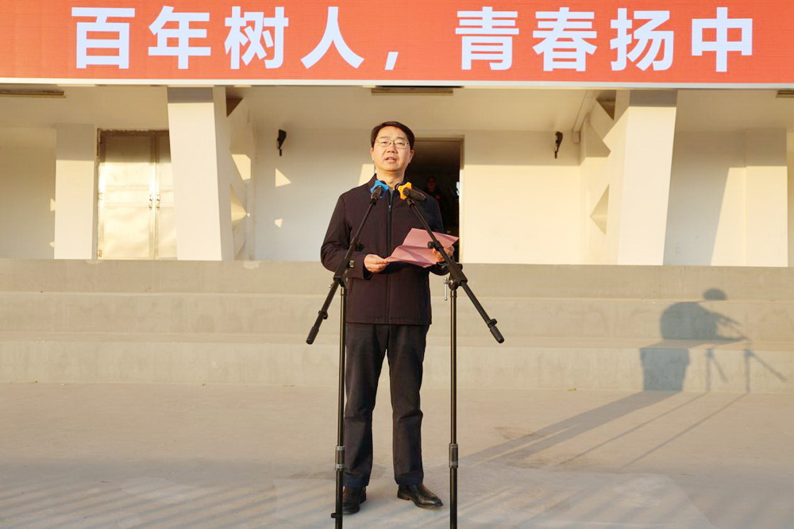
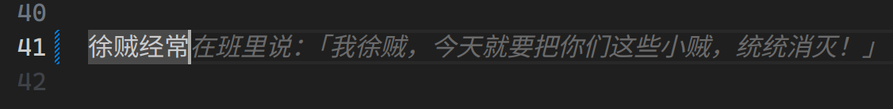
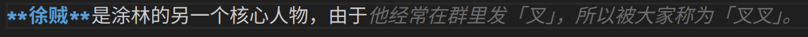
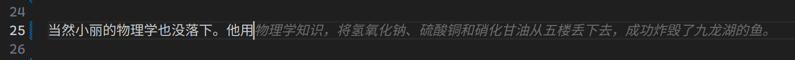
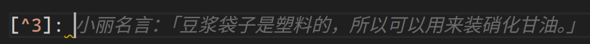

## 📢 發刊詞

2024 年在本蛾子的睡夢中悄然度過。本來想寫一篇年終總結，苦於手上什麼記錄都沒有（甚至已經忘記了體育中考在*哪個月*），遂放棄。

於是本蛾子決定，2025 年一定要留下一些東西，在走過的路上留下一些痕跡，這個想法催生了**貝羅桶週刊**。借鑑了[阮一峯的網絡日誌](https://www.ruanyifeng.com/blog/)和[天空隨想](https://skywt.cn/blog/)的組織思路，在這一系列文章中（希望能堅持到 #52 💪），本蛾子將雜糅個人經歷和網絡見聞，以幽默的方式講述本蛾子的想法，博君一笑爾 😄

至於這個奇怪的名字……就是 Barrel 的音譯和意譯的混合啦，英文名依照相同的規則定爲 Barrel Town Weekly。

## 🏙 封面

> 拿我揚中帥氣的艹義艹校長的圖片鎮樓 😁（[來源](http://61.155.62.52/yzzx/Article/ShowArticle.asp?ArticleID=8112)）

## 📚 期末複習

這個學期本蛾子經歷了（大概是）最後一次 OI，花了很長時間準備。最直接的後果就是，本蛾子缺課一週，外加數不清的史政地課程缺失，以及（由於補題導致的）熬夜的壞習慣。

> 本文的寫作時間是 23:05 😮‍💨

爲了高二能進入天招班（前 10% 左右），本蛾子需要保持高一的四次大考都在前 100 名。期中考試本蛾子以 80 名收場，但是期末考試就沒有那麼好的運氣了：課程缺失，難度上升，疊加其他因素，着實有點低谷。月考本蛾子可能年級排名掉到了 200 名，幸好不計入。

1 月 8 日（下週三）先考第二選科 4 門，1 月 14 日和 15 日考必選和第一選科 5 門。努力複習，爭取好成績 💪

## ⚙️ 折騰

- 🔨 對桶裝幺蛾子又進行了打磨。桶裝幺蛾子使用 Hugo 框架，主題是本蛾子魔改的 PaperMod。

  - 調整首頁標題佈局，去除了連接周圍醜陋的描邊。
  - 換回無襯線字體，更清楚，所有英文字符都使用等寬，只有標題保留了襯線。全家族 Noto 字體。
  - 簡單地寫了個也許算是「後臺」的腳本，操作文章更方便。

- 💁‍♂️ 新增了很多桶裝的服務。

  - Bug's Wardrobe：自託管的 Gitea，Git 服務器。
  - RSSHub：部署了一個 RSSHub 鏡像。
  - Snapdrop：局域網傳輸工具。

  服務列表可以在 [Barrel Services](https://bug-barrel.top)——也就是桶裝幺蛾子的根域名上看到啦。

- 📖 寫了一個發送 RSS 到 Kindle 的 Python 腳本，也算是練習 AI 融合開發了：[talentedbug/kingsrss-v2](https://github.com/talentedbug/kingsrss-v2)。

  > 😮 是的，曾經有一個 V1：[talentedbug/kingsrss](https://github.com/talentedbug/kingsrss)。但是代碼實在是太噁心，本蛾子都不像接着寫了。

這個週末的成果大概就是這樣了。

> ❌ 此處刪去了原本的「小論：媒體」。本蛾子不想將戾氣亂撒。

## 🤖 AI 開發

自從 2022 年 ChatGPT 一炮打響生成式 AI 的名號，似乎什麼東西都得跟 AI 搭上點兒邊纔算得上先進。AI 在服務端百花齊放，世界上 15% 的算力都拿來訓練 AI 了；在客戶端，也沒有落下，除了傳統的對話，文生圖、文生視頻等領域也在迅速發展。

各家最先進的模型，就本蛾子的體驗來看，除了極其苛刻的測試之外，大部分情境下都能在 2 到 3 次對話後給出準確的答案。尤其是在此前弱勢的「推理」部分，其一貫缺少的「注意到」能力在 o1 等模型中大幅提升。

但是對於 AI 來說，還有一個重要的領域，就是**寫代碼**。由於網絡條件的限制，本蛾子生活中運用 AI 最多的時候就是寫代碼了。接下來就來談談本蛾子的感受。

首先簡單看看本蛾子的工具集：

- Warp Terminal（免費：50 次對話，250 次補全）
- Cursor（免費：50 次對話，1000 次補全）
- GitHub Copilot（免費：50 次對話，2000 次補全）
- JetBrains 本地單行補全（免費）
- Microsoft Copilot 和 Google Gemini 等通用模型

最後一個是作爲上面幾個的補充：如果本蛾子用完了對話次數，就得麻煩一些，上傳相關代碼到對話界面，然後手動修改，優點是免費、好模型，缺點是挺煩。

這樣寫了幾個星期的代碼，本蛾子有幾點感受：

- 🛡 程序員還是安全的，沒有一個工具可以完全解決開發的全過程，即使是最先進的模型，輸出有時候也需要手動修改來滿足需要。另外，大型項目是很不方便的，因爲即使是付費也不能一次分析幾萬行代碼（當然企業自己部署也許可以）。

- 😲 對於不熟悉的領域很有用，比如本蛾子想寫一個簡單的用戶腳本，但是關於這個本蛾子啥也不懂，這時候直接向 AI 提出要求就很方便。

- 💵 免費的很夠用，特別是對於本蛾子這種業餘選手來說；但是如果要專業開發，那花錢必不可少，Cursor的 Starter Plan 一個月就 20 刀，真貴啊……

- 🤝 不要強制將 AI 融入開發，比如終端，AI 的融入真的就像多了一個不是那麼聰明的助手，有的時候還會搞出一些划子。

- 😄 有的時候 AI 也很麗譜。上圖：

  

  

  

  

## 👋 再見 2024，你好 2025

本蛾子的 2024 年，自認爲有幾件值得留念的事：

- 中考：人生中第一場大考，儘管分數不盡人意，但是也爲之努力過，本蛾子沒啥遺憾的。告別初中同學，最好的朋友很幸運地也考入揚中，四個塗林人三個在揚中，本蛾子可以繼續麗譜啦 🐸
- AFO：NOIP 2024 是本蛾子的最後一次 OI。抱着走一遭的心態去考，準備了一段時間，但是並沒有很大的壓力，最終考得也很爛。
- 服務器：本蛾子擁有了自己的服務器！運維技術有實踐的機會了。

2025 年纔剛剛開始，本蛾子還沒來得及想好這一年的 flag。但是有一點是肯定的：本蛾子希望這會是充滿幸運與快樂的一年，希望能辛勤耕耘而終有所收穫。

> 😁 當然還希望中央網信辦趕緊把本蛾子原來的域名解封……

## 🔖 書籤

這裏，本蛾子本來打算要放一些這周感興趣的內容的。但是本週直到週末纔想起來要寫週刊，腦子裏有很多想給大家看的，但是實在是找不到了。下次一定 😁

## 🎆 下週再見

本週的貝羅桶週刊就這樣吧。下週見，新年快樂！
