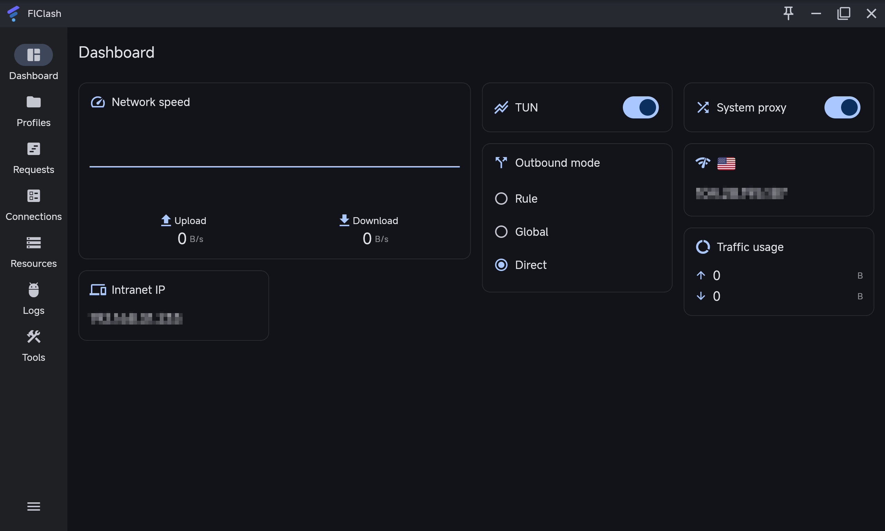
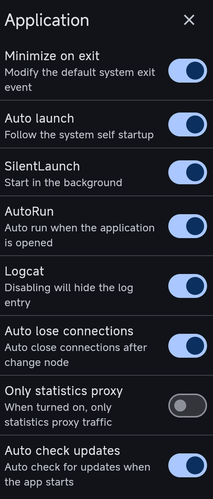
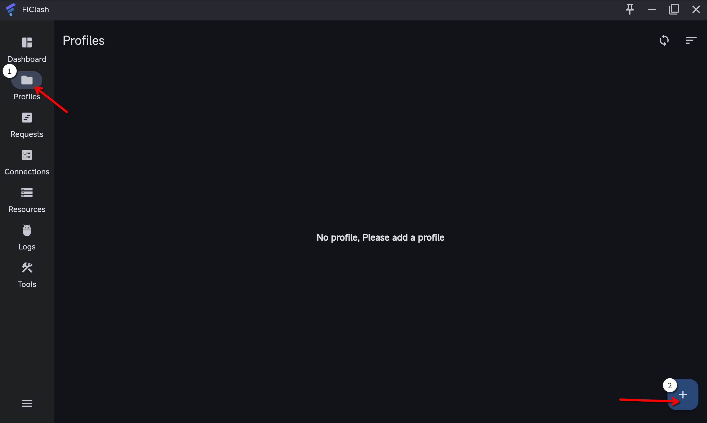
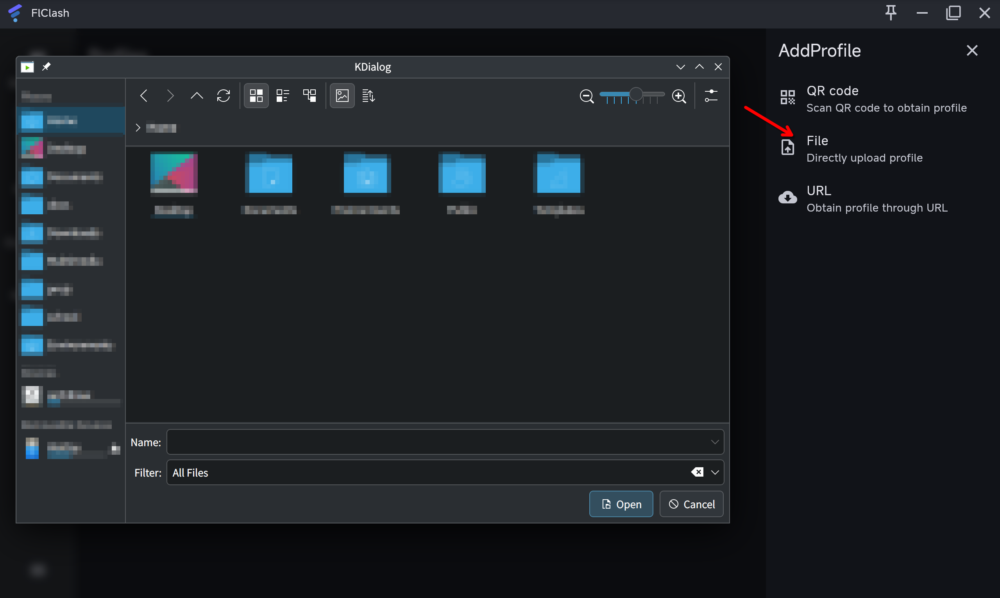
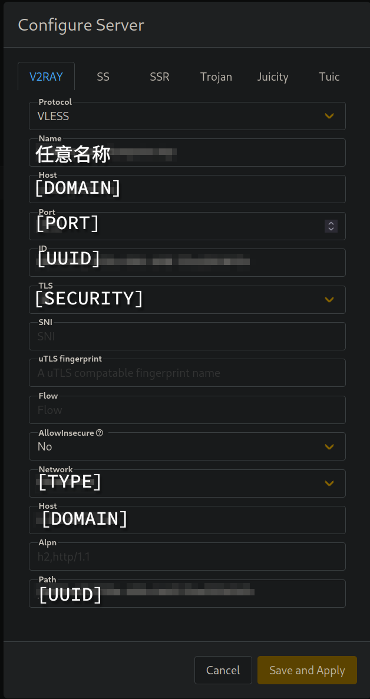

最近本蛾子發現之前搭建的代理，訪問部分國內網站的時候不光速度很慢，而且有時候會報 PR_END_OF_FILE_ERROR（無法確定內容完整性，就是遠程，特別是 CSDN，全站都無法訪問。

> 😮‍💨 唉：後來發現其實是服務端 WARP 的問題，跟 v2rayA 一毛錢關係都沒有。

本蛾子現在使用的 v2rayA 雖然安裝起來很方便（Arch Linux CN 有打包），但是對於規則的支持並不算好，並且開啓、關閉、切換節點的速度也不盡人意。在網上搜索一通，似乎眼下最完善的內核是 Clash 系列的後繼者 Mihomo，因此本蛾子就用它來學習一下**如何書寫 Clash 配置文件**。

## 💻 客戶端選擇

Clash 系的客戶端在 AUR 上基本全部都有打包。根據本蛾子的測試，似乎還在開發且可用性比較高的，只有 Clash Verge Rev 和 FlClash，而後者的 UI 設計本蛾子看着非常舒服，因此本文就以 FlClash 作爲測試客戶端。

首先對 FlClash 的軟件設置進行調整。雖然諸多 Clash 系客戶端使用同一個內核，但是其 UI 設計卻千差萬別。FlClash 的界面大概是這樣的。



在 Tools 欄目中，主要是軟件本身和覆寫配置文件的選項，前者是主題、日誌、自動啓動等本地定義的選項，不出現在配置文件中，因此我們首先來完成對其的設置。覆寫配置文件的設置主要針對使用遠程配置文件（例如機場）的用戶，方便修改配置文件。



選項大部分您都應該能理解，說幾個比較迷惑的：

- Logcat：就是日誌功能，記錄您使用代理訪問的網站，關閉之後不會記錄，但是似乎需要手動刪除之前的記錄（位於您的主目錄下）。
- Auto lost connections：在切換節點之後切斷當前存在的連接，開啓之後換區域會更加徹底，但是您的下載會被終端。
- Only statistics proxy：只對通過的流量進行記錄，這時候 FlClash 就變成了一個網絡監測工具。

當然這個欄目還有其他功能，比如設置語言、主題、備份之類的，就請您自己探索了。

## ⚙️ 配置文件

這當然就是本文的重點了！通過 Clash 配置文件，您可以方便地修改 DNS、分流、（基礎）去廣告等，至於節點鏈接，倒成了配置文件中不太重要的一部分了。下面本蛾子參考了一些鏈接和項目，爲行文流暢就不一一列出角標了，一併在文末引用。

您書寫的配置文件應當保存在任意名稱的 `.yaml` 文件中，在 FlClash 中這樣引用：





### 🏠 基礎

Clash 配置文件使用 YAML 的語法，以 `key: value` 的形式書寫，注意中間的空格不可以省略。如果一個鍵有子鍵，那麼需要縮進並添加 `-`；註釋以 `#` 開頭。示例請見下文說明。

一個 Clash 配置文件類似於這樣：

```yaml
mixed-port: 7890
allow-lan: false
# bind-address: "*"
ipv6: true
mode: rule
log-level: info
# external-controller: 127.0.0.1:9090
# secret:""
dns:
proxies:
proxy-groups:
rules:
```

每一個選項的含義：

- `mixed-port`：混合端口，即 Clash 內核所使用的端口，支持 HTTP、SOCKS 等代理協議混用。
- `allow-lan`：是否允許局域網連接，如果您希望連接其他設備可以連接代理，您應當將其設置爲 `true`，公用網絡下無論如何都應當設置爲 `false` 來保證安全。
- `bind-address`：綁定地址，在 `allow-lan: true` 的情況下，端口允許的地址，例如 `0.0.0.0` 代表您設備在網絡中的 IP 地址（所有 IPv4 設備均可連接），`127.0.0.1` 代表迴環地址（只有本機可以連接），`::` 代表您設備的 IPv6 地址等等；設置爲 `"*"` 即允許所有設備連接。
- `ipv6`：是否啓用 IPv6，這要看您路由器是否支持。設爲 `true` 沒啥壞處。
- `mode`：模式，接下來我們將使用規則集，因此要設成 `rule` 即規則模式。其他還有 `direct`（不走代理）和 `global`（全走代理）。
- `log-level`：日誌等級，`info` 比較適中，也可設成 `error`（僅錯誤）、`warning`（錯誤和警告）、`debug`（所有記錄）、`silent`（不輸出）。
- `external-controller` 和 `secret`：控制端口和密碼，非常建議設置爲 `127.0.0.1` 而非 `0.0.0.0`，後者將把控制界面向局域網開放。
- 其他的是接下來討論的重點。

當然其實還有個 `authentication` 即代理認證功能，請您自行查閱文末引用，有詳細介紹。本文主要討論作爲本地代理的功能，不過度介紹。

## 🗺️ DNS

在上述配置中繼續添加。

DNS 是互聯網上用於查找域名對應 IP 地址的工具，您在瀏覽器中輸入的所有域名都會被髮送到 DNS 服務器解析，然後再訪問 IP。由於純 DNS 使用的是未經加密的 UDP 包，非常容易被污染篡改，早年間的 GFW 主要就採用 DNS 污染的方式封禁域名。

說實話，本蛾子建議您就算不使用代理，也按照下文方法（在 FlClash 或操作系統中）設置安全的 DNS 方案，詳情請見文末引用的部分文章。

但是後來由於 DoH 即 DNS over HTTPS 技術的出現（其實還有 HTTPS 本身），GFW 原本準確的 DNS 污染和選擇性屏蔽頁面形同虛設，就開始使用 IP 黑洞這種最簡單、最暴力的方法屏蔽一些網站。

> 當然對於 Cloudflare 這種 IP 大戶還是沒什麼用，於是對於 `*.pages.dev` 和 `*.workers.dev` 又開始了域名封鎖。

無論如何，您在使用代理時，最好還是要添加一下 DNS 配置。例如：

```yaml
dns:
  enable: true
  prefer-h3: true
  use-hosts: true
  use-system-hosts: true
  respect-rules: false
  listen: 0.0.0.0:1053
  ipv6: false
  enhanced-mode: fake-ip
  fake-ip-range: 198.18.0.1/16
#  fake-ip-filter:
#    - '*.lan'
#    - "+.local"
#    - localhost.ptlogin2.qq.com
  default-nameserver:
    - 8.8.8.8
    - 1.1.1.1
    - 223.5.5.5
    - 119.29.29.29
# nameserver-policy:
#   'www.baidu.com': '114.114.114.114'
#   '+.internal.crop.com': '10.0.0.1'
#   'geosite:cn,private':
#   - https://223.5.5.5/dns-query
#   - https://223.6.6.6/dns-query
  nameserver:
    - https://dns.alidns.com/dns-query
    - https://doh.pub/dns-query
  proxy-server-nameserver:
    - https://dns.alidns.com/dns-query
    - https://doh.pub/dns-query
  fallback:
    - https://dns.google/dns-query
    - https://cloudflare-dns.com/dns-query
    - 8.8.8.8
    - 1.1.1.1
  fallback-filter:
    geoip: true
    geoip-code: CN
    geosite:
      - gfw
    ipcidr:
      - 240.0.0.0/4
      - 0.0.0.0/32
      - 127.0.0.1/32
#    domain:
#      - '+.google.com'
#      - '+.facebook.com'
#      - '+.youtube.com'
```

簡單解釋一下：

- `enable`：啓用 DNS 設置。

- `prefer-h3`：加密的、使用 QUIC 實現的 DNS 協議，有助於加快查詢速度。

- `use-hosts` 和 `use-system-hosts`：是否使用 `hosts` 優先查詢。`hosts` 是獨立於 DNS 系統的查詢文件，一般在操作系統中定義，可以把某些地址強制解析到特定 IP 上，例如實際上 `localhost` 這個地址並不存在，是操作系統在 `hosts` 中定義了 `127.0.0.1 localhost`。建議開啓。

- `respect-rules`：優先遵守下文規則的設置，如果您使用機場，不建議開啓，因爲如果機場定義了 DNS 設置會導致您的配置失效。（如果沒有，就無所謂了，這玩意兒就成了「自尊」😄）

- `fake-ip-*`：這是個比較有意思的東西。正常來說，瀏覽器查詢 DNS 服務器，得到 IP，然後訪問；但是如果 Clash 開啓了 `fake-ip`，瀏覽器得到 Clash 的解析結果都指向 `fake-ip-range` 中的一個隨機地址，然後對其發送請求，再由 Clash 來請求服務端。

  > 由此也可以發現，Clash 運行時一定會劫持 DNS，所以如果您發現 DNS 設置不正常，不必驚慌。

  `fake-ip-filter` 還可以定義不使用 `fake-ip` 的地址，一般不需要，除了 QQ 對於本地的請求也使用域名……

- `default-nameserver`：如果定義了 `nameserver`，此配置將用於解析 DoH 域名，從上至下輪詢直到得到第一個結果。由於我們使用代理，就優先選擇國外服務；如果您想配置不開代理的 DoH，需要將國內的幾個調到上面。

  > DoH 地址也是域名，也需要解析……所以有的時候稱爲「引導域名服務器」。

- `nameserver`：默認 DNS 服務器，但是由於下文設置了 `fallback-filter`，所有 GeoIP 非 CN 的域名實際上會採用 `fallback`，因此這裏僅針對國內網站。

- `nameserver-policy`：域名解析規則，對於特定域名採用指定 DNS 服務器。

- `proxy-server-nameserver`：用於解析代理服務器域名的 DNS 服務器，建議設國內地址，因爲這個流量不走代理。

- `fallback`：後備 DNS 服務器。若第一輪解析結果顯示其 GeoIP 非 CN，則使用這些服務器驗證。

- `fallback-filter`：過濾器，負責決定哪些域名需要使用 `fallback` 驗證：

  - `geoip-code`：**除了**該國家代碼的解析結果，全部視爲已經污染，進入 `fallback`。

  - `geosite`：在列表中的全部視爲污染，進入 `fallback`。

  - `ipcidr`：如果解析結果是這些網段，則認爲是污染。

    > 這是因爲 GFW 在 DNS 污染之後還是要返回結果的，通常就是迴環地址或者不存在的 IP，因此可以根據這一點來判斷是否被污染。文末的維基學院參考提供了一個污染返回的結果列表，但是本蛾子未採用，因爲該列表有極大概率濫殺無辜 😮‍💨

  - `domain`：對於這些域名，直接使用 `fallback`。

### 👷‍♂️ 代理

這裏你應當填寫你的訂閱鏈接。如果您獲得的鏈接是類似於 `vless://...` 的格式，您需要先進行轉換。下面本蛾子給出一個示範。

對於 `vless://[UUID]@[DOMAIN]:[PORT]?encryption=[ENCRYPTION]&security=[SECURITY]&type=[TYPE]&host=[DOMAIN]&path=[UUID2]#[TAB]` 這樣的鏈接，如果我們使用 v2rayA 進行解析（自動分開各個部分），就會發現實際上是這個意思：



那麼根據 Clash 對應格式，就應該寫爲：

```yaml
proxies:
  - name: "any_name_is_okay"
    type: vless
    server: [DOMAIN]
    port: [PORT]
    uuid: [UUID]
    udp: true
    tls: true
    network: ws
    servername: [DOMAIN]
    ws-opts:
      path: "/[UUID]"
      headers:
        Host: [DOMAIN]
```

如果您使用的方案與本蛾子不相同，請您查看參考中的 GitLab 倉庫，其中有最常見的 13 種代理的配置模板。

這部分沒什麼好說的，本蛾子也變不出來新的訂閱 🧙‍♂️

### 🧭 策略組

如果您使用機場，機場應當已經給您配置好了，直接下載即可。如果您需要自定義，也可以在網上搜一搜好用的模板，直接下載即可。對於本蛾子自建節點來說，就不需要了（只有一個節點）😄

只需要添加一個 PROXY 組，代表使用代理，Clash 內置了 REJECT 和 DIRECT 組，分別表示「拒絕連接」和「直接連接」。

```yaml
proxy-groups:
  - name: "PROXY"
    type: select
    proxies:
      - "any_name_is_okay"
```

### 🔌 分流規則

這應該是這篇文章的重頭戲了！畢竟本蛾子寫這篇文章就是因爲喫了沒有做好分流的苦。

> ⚠️ 注意：部分站點（如 ChatGPT）會到處連接來確定您是否位於 OpenAI 不提供服務的區域。在這種情況下，建議啓用全局代理。

由於網站的數量是無限的，無論是您還是本蛾子還是網上的大神，這部分配置大概都不是一個字一個字打出來的，因此我們直接採用別人搞好的規則集。本蛾子搜了一圈，好像比較好用的是 Loyalsoldier/clash-rules（鏈接請見參考），如下配置：

> 本蛾子採用了全套配置，可能稍有多於，您可以自行刪除一部分

```yaml
rule-providers:
  reject:
    type: http
    behavior: domain
    url: "https://cdn.jsdelivr.net/gh/Loyalsoldier/clash-rules@release/reject.txt"
    path: ./ruleset/reject.yaml
    interval: 86400

  icloud:
    type: http
    behavior: domain
    url: "https://cdn.jsdelivr.net/gh/Loyalsoldier/clash-rules@release/icloud.txt"
    path: ./ruleset/icloud.yaml
    interval: 86400

  apple:
    type: http
    behavior: domain
    url: "https://cdn.jsdelivr.net/gh/Loyalsoldier/clash-rules@release/apple.txt"
    path: ./ruleset/apple.yaml
    interval: 86400

  google:
    type: http
    behavior: domain
    url: "https://cdn.jsdelivr.net/gh/Loyalsoldier/clash-rules@release/google.txt"
    path: ./ruleset/google.yaml
    interval: 86400

  proxy:
    type: http
    behavior: domain
    url: "https://cdn.jsdelivr.net/gh/Loyalsoldier/clash-rules@release/proxy.txt"
    path: ./ruleset/proxy.yaml
    interval: 86400

  direct:
    type: http
    behavior: domain
    url: "https://cdn.jsdelivr.net/gh/Loyalsoldier/clash-rules@release/direct.txt"
    path: ./ruleset/direct.yaml
    interval: 86400

  private:
    type: http
    behavior: domain
    url: "https://cdn.jsdelivr.net/gh/Loyalsoldier/clash-rules@release/private.txt"
    path: ./ruleset/private.yaml
    interval: 86400

  gfw:
    type: http
    behavior: domain
    url: "https://cdn.jsdelivr.net/gh/Loyalsoldier/clash-rules@release/gfw.txt"
    path: ./ruleset/gfw.yaml
    interval: 86400

  tld-not-cn:
    type: http
    behavior: domain
    url: "https://cdn.jsdelivr.net/gh/Loyalsoldier/clash-rules@release/tld-not-cn.txt"
    path: ./ruleset/tld-not-cn.yaml
    interval: 86400

  telegramcidr:
    type: http
    behavior: ipcidr
    url: "https://cdn.jsdelivr.net/gh/Loyalsoldier/clash-rules@release/telegramcidr.txt"
    path: ./ruleset/telegramcidr.yaml
    interval: 86400

  cncidr:
    type: http
    behavior: ipcidr
    url: "https://cdn.jsdelivr.net/gh/Loyalsoldier/clash-rules@release/cncidr.txt"
    path: ./ruleset/cncidr.yaml
    interval: 86400

  lancidr:
    type: http
    behavior: ipcidr
    url: "https://cdn.jsdelivr.net/gh/Loyalsoldier/clash-rules@release/lancidr.txt"
    path: ./ruleset/lancidr.yaml
    interval: 86400

  applications:
    type: http
    behavior: classical
    url: "https://cdn.jsdelivr.net/gh/Loyalsoldier/clash-rules@release/applications.txt"
    path: ./ruleset/applications.yaml
    interval: 86400
```

以上是對規則集的引用。

- `type`：規則集的協議類別，本文均爲針對 HTTP。
- `behavior`：規則集的內容類別。
- `url`：下載地址，本文選擇使用 jsDelivr 的源。
- `path`：下載的規則集的保存位置。
- `interval`：更新時間間隔，這個規則集使用 GitHub Actions 每天更新一次，因此我們也每天重新下載一次。

下面需要繼續添加規則，來使用這些規則集：

```yaml
rules:
  - RULE-SET,applications,DIRECT
  - RULE-SET,private,DIRECT
  - RULE-SET,reject,REJECT
  - RULE-SET,icloud,DIRECT
  - RULE-SET,apple,DIRECT
  - RULE-SET,google,PROXY
  - RULE-SET,proxy,PROXY
  - RULE-SET,direct,DIRECT
  - RULE-SET,lancidr,DIRECT
  - RULE-SET,cncidr,DIRECT
  - RULE-SET,telegramcidr,PROXY
  - GEOIP,LAN,DIRECT
  - GEOIP,CN,DIRECT
  - MATCH,PROXY
```

> 由於本蛾子不適用 YACD 面板，以上規則集刪除了兩個 YACD 面板的域名。

這個部分應該很好理解：

- `RULE-SET`，`GEOIP`，`GEOSITE` 或 `DOMAIN` 表示匹配的類型。
- 後面是匹配的屬性。
- `DIRECT`，`REJECT` 和 `PROXY` 分別代表「直接訪問」「拒絕訪問」和「使用代理訪問」。

本蛾子是 Arch Linux 用戶，需要不時使用 BFSU、USTC 或者 TUNA 的源進行更新，並且本蛾子不希望使用代理下載包（容易中斷，而且浪費流量），因此額外添加了幾條：

```yaml
rules:
  ...
  - DOMAIN,mirrors.bfsu.edu.cn,DIRECT
  - DOMAIN,mirrors.ustc.edu.cn,DIRECT
  - DOMAIN,mirrors.tuna.tsinghua.edu.cn,DIRECT
```

以上是白名單模式，因此不在列表中的域名會自動採用代理。

## 🎆 下課

經過這些配置，應該差不多就可以順利地使用代理了！

這些只是最基本的配置，Clash Meta 內核還在不斷發展，也不斷有新的協議和工具出現。本蛾子建議您看看結尾的參考文章，相信能給您更多啓發！

> 💡 提示：本文不提供完整的樣板。本蛾子認爲配置 Clash 是一個非常個人化的工作，沒有所謂的「最佳實踐」。請您認真閱讀本文，相信您可以配置得比本蛾子更好！

> ➕ 本文參考或引用了以下來源：
>
> [【保姆級教學】掰碎了給你講！Clash配置文件詳解（含實戰演練）](https://linux.do/t/topic/163682)（原作者：[崔裕姝](https://linux.do/u/Yuju)）
>
> [Loyalsoldier/clash-rules: 🦄️ 🎃 👻 Clash Premium 規則集(RULE-SET)，兼容 ClashX Pro、Clash for Windows 等基於 Clash Premium 內核的客戶端。](https://github.com/Loyalsoldier/clash-rules)（原作者：[Loyalsoldier](https://github.com/Loyalsoldier)）
>
> [Clash 知識庫](https://clash.wiki/)（原作者：原文未標註，疑似[Dreamacro](https://github.com/Dreamacro)）
>
> [DNS 污染和劫持原理](https://xiking.win/2019/03/27/dns-cache-pollution/)（原作者：[人身如逆旅，我亦是行人](https://xiking.win/)）
>
> [防火長城域名服務器緩存污染 IP 列表](https://zh.wikiversity.org/wiki/%E9%98%B2%E7%81%AB%E9%95%BF%E5%9F%8E%E5%9F%9F%E5%90%8D%E6%9C%8D%E5%8A%A1%E5%99%A8%E7%BC%93%E5%AD%98%E6%B1%A1%E6%9F%93IP%E5%88%97%E8%A1%A8)（[維基學院](https://zh.wikiversity.org)）
>
> [Misaka-blog/clash-meta: 這是一個基於 Clash Meta 訂閱的配置文件模板](https://gitlab.com/Misaka-blog/clash-meta)（原作者：[Misaka-blog](https://gitlab.com/Misaka-blog)，博客已刪）
