本蛾子家里有一部[香橙派 Zero 3](http://www.orangepi.org/html/hardWare/computerAndMicrocontrollers/details/Orange-Pi-Zero-3.html) 一直在吃灰。

最近期末复习，大量打印试卷，只有蛾爸的台式机连着一台 HP LaserJet 打印机，不得不断断续续打扰他玩游戏去打印。蛾爸说，唉，要么买一台带 Wi-Fi 打印功能的新打印机吧！一看价格，动辄 2000 多。

于是本蛾子在网上搜了搜，发现 HP 对 Linux 的驱动支持很好。在提出将打印机挪到本蛾子的房间的要求并被拒绝之后，猛地想起来这部吃灰的香橙派，插电看看，更新一下包，还能用。遂记录一下操作方法供您参考 😁

## 🛜 Wi-Fi 上网

之前这部单板机一直都是直接插网线上网的，但由于房间里唯一的网线接口被蛾爸的台式机占据，不得不使用无线网络。

Armbian 竟然不自带 `network-manager`，先自己装一个。

```bash
sudo apt update && sudo apt upgrade
sudo apt install network-manager
sudo systemctl enable --now NetworkManager # 大小写敏感
```

然后用 `nmtui` 连接一下无线网。

```bash
sudo nmtui
```

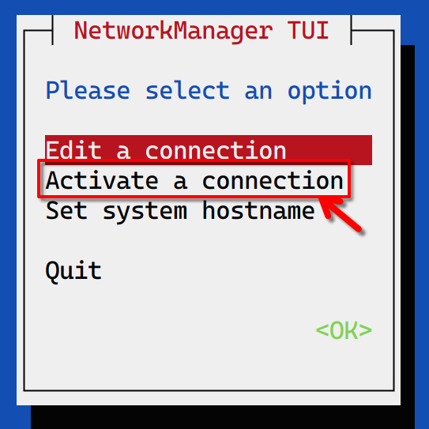

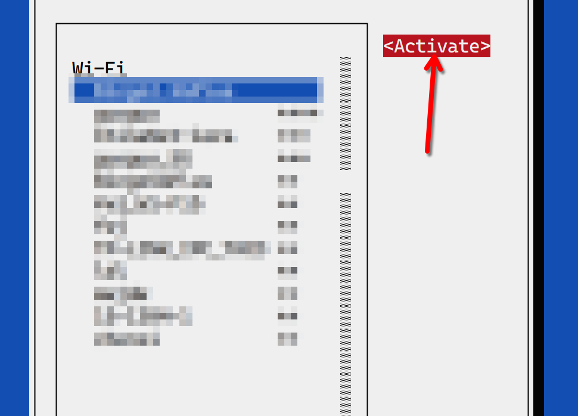

然后选择你的 Wi-Fi 连接即可。

使用 `ip addr` 验证一下：

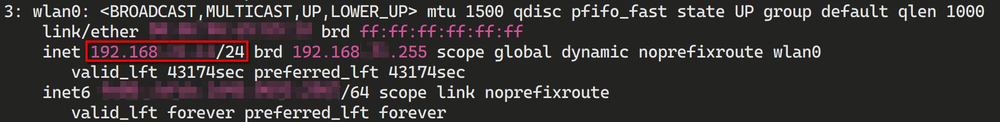

可以发现已经 DHCP 了一个 Wi-Fi IP 段的 IP。

本蛾子家的路由器似乎不按照递增的顺序添加 IP，因此还需要设置一下静态 IP，以防失联：

```bash
sudo nmtui
```

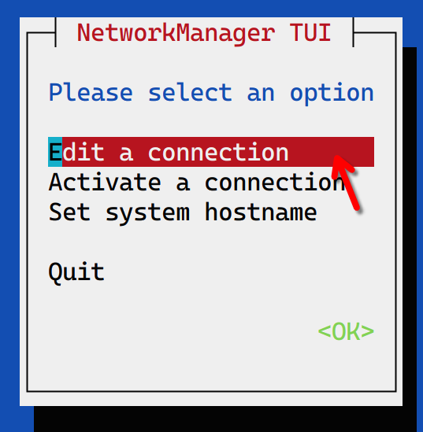

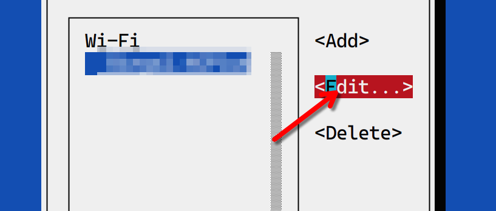

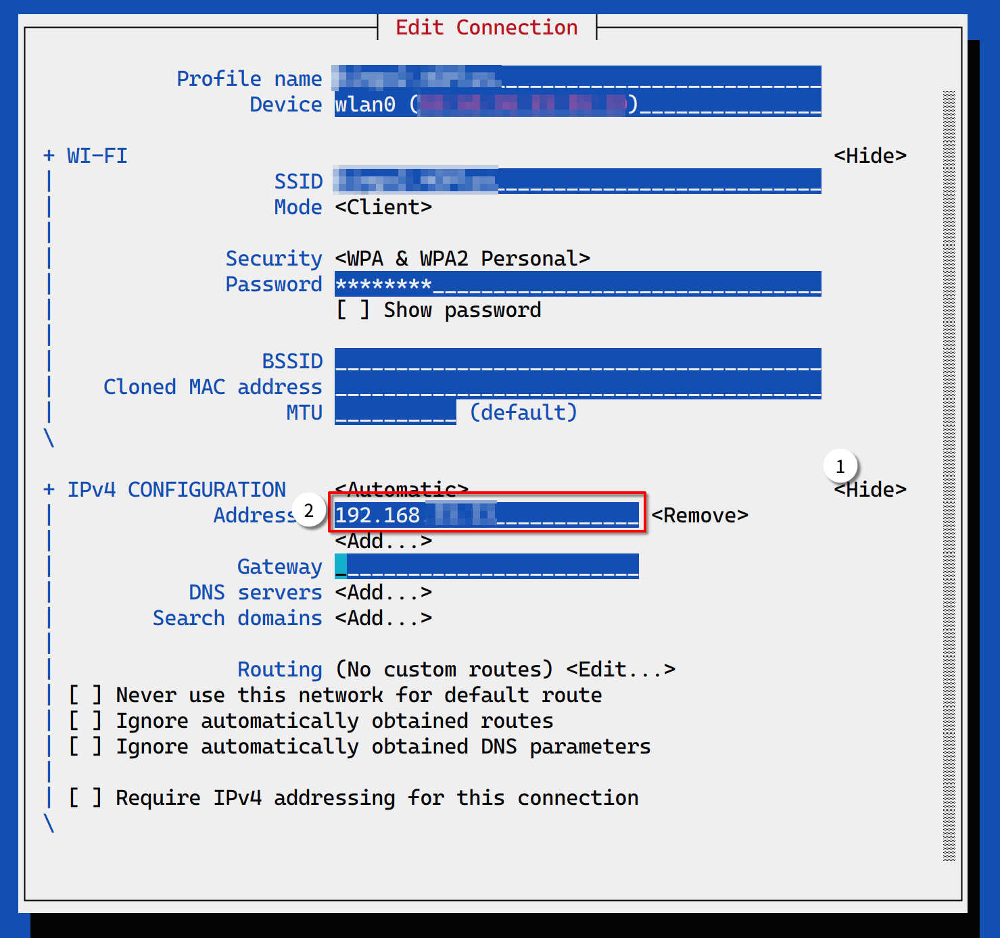

重启一下 `network-manager` 看看：

```
sudo systemctl restart NetworkManager
```

很好，还是原来的 IP 地址。现在我们临时关闭 SSH 强制证书认证（撤销[使用 SSH 公钥登录服务器并禁用密码 | 桶装幺蛾子](https://hi.bug-barrel.top/posts/5baaf9322f/)中的操作），用 Wi-Fi IP 连接一下。

重启 sshd：

```bash
sudo systemctl restart sshd
```

这时候，不要着急关闭原来的 SSH 连接，新开一个窗口，用新 IP 地址连接。

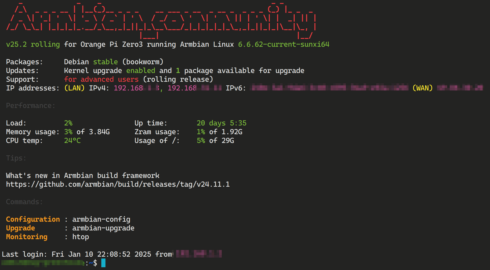

成功 ✌️ 然后您可以按照上面那篇文章的方法，重新生成证书并关闭密码登录。

## 🖨 CUPS 配置

```bash
sudo apt install cups
sudo usermod -aG lpadmin USER_NAME # 添加已有的用户为管理员
# sudo useradd -m -G lpadmin USER_NAME # 也可以新建一个用户
# passwd USER_NAME # 记得修改密码
sudo cupsctl --remote-any
```

如果您使用防火墙，记得放行 631 端口：

```bash
sudo firewall-cmd --add-port=631/tcp --permanent
sudo firewall-cmd --reload
```

然后就可以从 `http://YOUR_IP:631` 访问到 CUPS 的管理页面了。

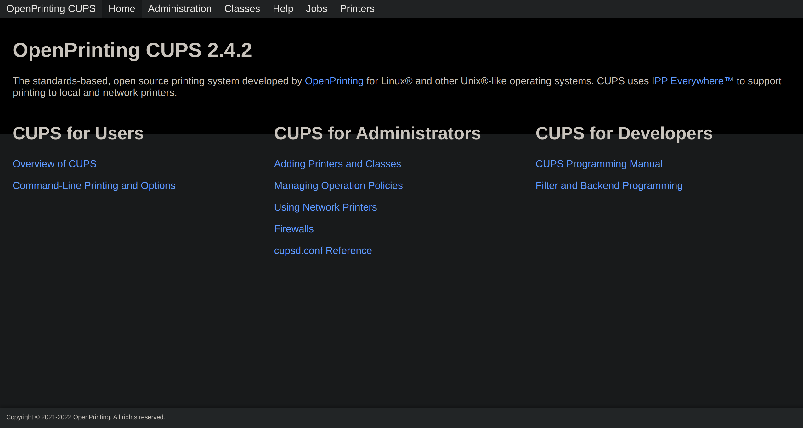

其实 CUPS 最初是 Apple 在开发，因为其 macOS 也是 UNIX-like 系统，为其开发了打印机管理工具。但是后来开发工作似乎转交给了 OpenPrinting，所以这个版本上首页不再出现 Apple 字样了。

然后接上你的打印机，只要不是特别远古的基本都是 USB 接口了，然后点击上面页面中的「Administration」，会要求您使用 HTTPS 访问，如果出现证书无效的警告，这是因为 HTTPS 使用的证书是自签发的，浏览器没法验证，直接继续访问即可。

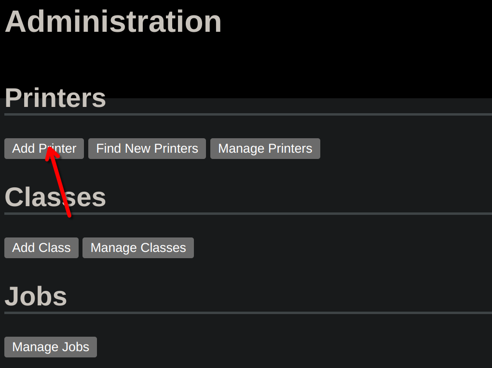

点击「Add Printer」。然后需要您用刚刚创建或者添加权限的那个用户登录。

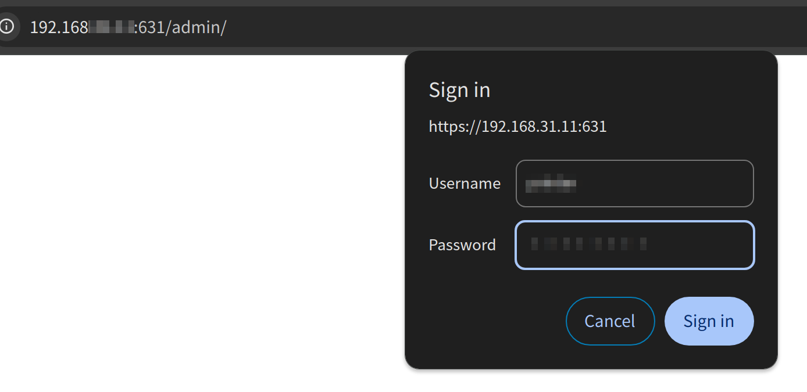

大部分 Linux 发行版都自带 HP 打印机的驱动，没啥问题的话，应该可以直接找到打印机，例如本蛾子的 HP LasetJet M1005 是可以自动识别的。

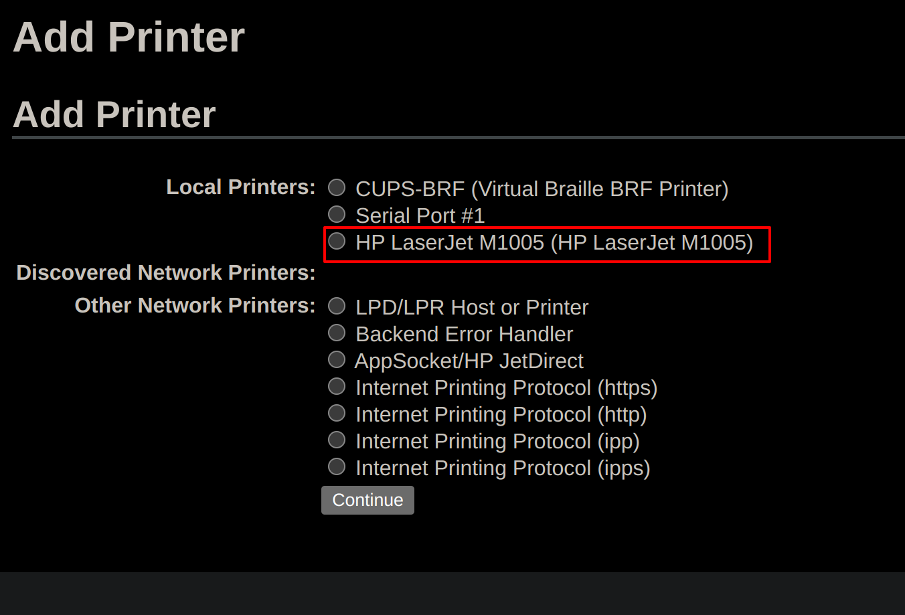

直接选择，然后点击「Continue」。然后填写一下向用户展示的信息，这个大概是无所谓的，保持默认即可。注意一定要勾选「Share This Printer」，以便内网用户访问。

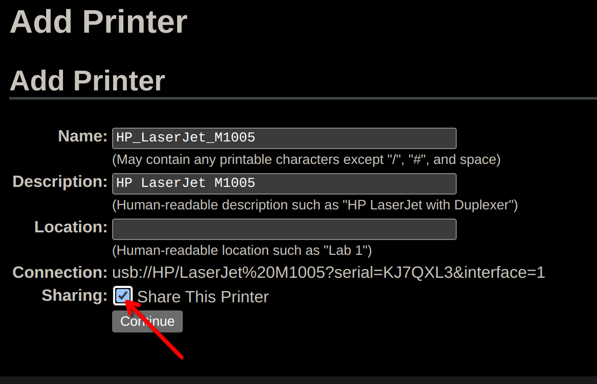

然后会让您选择型号，但是本蛾子发现这里并没有 M1005 的选项。搜了一下，需要装一个 PDD 描述文件。

```bash
sudo apt install hplip
```

装完刷新一下页面，重新填写。这样就有了，但是不知道为什么有三个 🤔

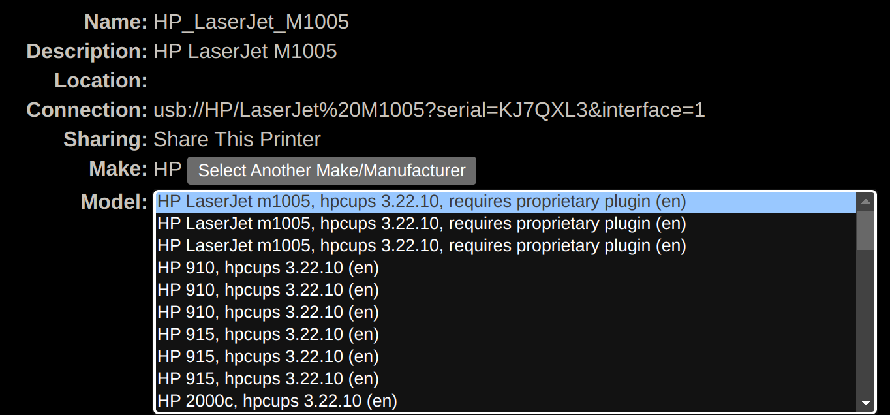

然后提示添加成功，但是最好还是打印一下测试页，因为就算描述文件是错误的也不会给出警告。

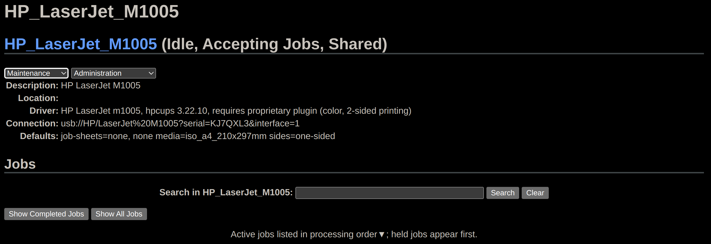

果不其然，打印失败了。搜索一下，发现这部打印机需要专有驱动支持，直接使用 `hp-plugin` 安装，发现下载非常慢，因此转而在本机下载，然后用 SFTP 传送到单板机上。

```bash
chmod +x hplip-3.22.10-plugin.run
sudo hp-plugin -i
# 输入 `p`，然后输入路径，忽略没有密钥的警告
```

这时候再打印测试页，发现打印成功，主要是 CUPS 的图标、Debian 的图标，还有一些色阶的测试（当然是看不来的，黑白打印啊），下面输出了一些信息。

## 🖥 客户端设置

Windows 打印，到这里就结束了，只需要在设置里添加设备，就能自动扫描网络并找到设备。但是 Linux 和 macOS 还需要额外设置。

本蛾子使用的是 Arch Linux 和 KDE Plasma，图形界面管理只需要安装一个 `system-config-printer` 包即可。在系统设置的打印机设置里，选择添加打印机，输入刚刚那个管理界面的网址（`http://IP:PORT/printers/NAME`），点击右侧的搜索，没啥问题的话就会显示。


接下来会要求提供 PPD 文件。问题来了，这时候大概是没有任何 PPD 文件供您选择的。这是因为尽管打印机连接到单板机上，但是您在本地还是需要和单板机上一样配置一遍 CUPS 的。

```bash
sudo pacman -Sy cups hplip
sudo systemctl start cups
sudo hp-plugin -i # 与刚刚相同的操作
```

重新打开系统设置，会发现这次可以选择 PPD 文件了，根据您的打印机型号，选择预置的 PPD 文件即可。


最后记得点击「Add」保存设置。然后可以在设置里将其设定为默认打印机，同样可以打印测试页。


macOS 的设置与之很类似，毕竟使用了同一套 CUPS 嘛。完成之后，就可以拿 LibreOffice 之类的尝试打印啦。

## 🎆 下课

本蛾子终于是不需要叫蛾爸打印了啊！单板机也废物利用，太棒了。
